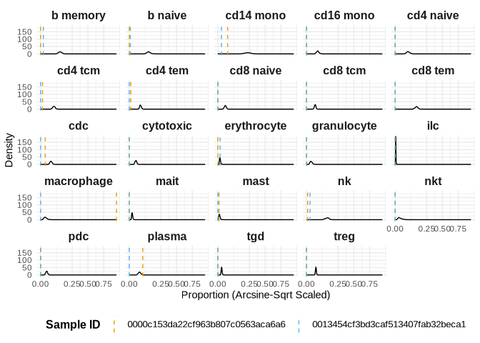

posteriorHCA
================

<!-- badges: start -->

[](https://lifecycle.r-lib.org/articles/stages.html#experimental)

<!-- badges: end -->

`PosteriorHCA` applies **Bayesian inference** from the `sccomp` package
to model the comprehensive **Human Cell Atlas (HCA)**, allowing
researchers to probabilistically measure human cellular composition.

This package **models variations in tissue composition** across:

-   **Cell Types**

-   **Sex**

-   **Age**

-   **Ethnicity**

-   **Disease conditions**

-   **Tissue Groups**

The probabilistic landscape is **pre-trained**, meaning it represents a
**posterior distribution** estimated from millions of cells.
`PosteriorHCA` makes this **queryable**, allowing researchers to:

-   **Test hypotheses** against a precomputed reference baseline.
-   **Compare new samples** to the expected cellular composition
    distribution.
-   **Assess how cell proportions vary** across human conditions.

## **Installation**

To install the latest development version of `PosteriorHCA` from GitHub,
run:

``` r
# Install devtools if not already installed
install.packages("devtools")

# Install PosteriorHCA from GitHub
devtools::install_github("MangiolaLaboratory/posteriorHCA")
```

Once installed, load the package:

``` r
library(posteriorHCA)
```

## Usage Example

### 1. Load relavent packages and example data

The package includes a small example dataset for demonstration:

``` r
library(dplyr)
library(tidyr)
library(ggplot2)

data(example_proportions)
print(example_proportions)
#> # A tibble: 48 × 3
#>    sample_id                        cell_type proportion
#>    <chr>                            <chr>          <dbl>
#>  1 0000c153da22cf963b807c0563aca6a6 b memory    0       
#>  2 0000c153da22cf963b807c0563aca6a6 b naive     0       
#>  3 0000c153da22cf963b807c0563aca6a6 cd14 mono   0.0259  
#>  4 0000c153da22cf963b807c0563aca6a6 cd16 mono   0       
#>  5 0000c153da22cf963b807c0563aca6a6 cd4 naive   0       
#>  6 0000c153da22cf963b807c0563aca6a6 cd4 tcm     0.00104 
#>  7 0000c153da22cf963b807c0563aca6a6 cd4 tem     0.000692
#>  8 0000c153da22cf963b807c0563aca6a6 cd8 naive   0       
#>  9 0000c153da22cf963b807c0563aca6a6 cd8 tcm     0       
#> 10 0000c153da22cf963b807c0563aca6a6 cd8 tem     0       
#> # ℹ 38 more rows
```

### **2. Run Posterior Testing**

The core function, `posterior_test()`, allows testing new data against
the probabilistic model:

``` r
result <- posterior_test(
    proportions = example_proportions,
    sex = "male",
    age_bin = "Middle Age",
    disease_groups = "Normal",
    ethnicity_groups = "European",
    tissue_groups = "blood", 
    load_model_to_global_env = T
)
#> ℹ Using cached model file: /home/chzhan1/.cache/R/posteriorHCA/estimates_age_bins___L2.rds
#> Model file loaded: Global Env.
#> All inputs of metadata are valid.
#> Start to generative sampling form posterior...
#> Loading model from cache...
#> Running standalone generated quantities after 1 MCMC chain, with 1 thread(s) per chain...
#> 
#> Chain 1 finished in 0.0 seconds.
#> # A tibble: 48 × 7
#>    sample_id_observed  cell_type proportion_observed Empirical_Confidence   mean
#>    <chr>               <chr>                   <dbl>                <dbl>  <dbl>
#>  1 0000c153da22cf963b… b memory             0                           0 0.103 
#>  2 0000c153da22cf963b… b naive              0                           0 0.101 
#>  3 0000c153da22cf963b… cd14 mono            0.0259                      0 0.226 
#>  4 0000c153da22cf963b… cd16 mono            0                           0 0.0348
#>  5 0000c153da22cf963b… cd4 naive            0                           0 0.0465
#>  6 0000c153da22cf963b… cd4 tcm              0.00104                     0 0.0484
#>  7 0000c153da22cf963b… cd4 tem              0.000692                    0 0.0348
#>  8 0000c153da22cf963b… cd8 naive            0                           0 0.0154
#>  9 0000c153da22cf963b… cd8 tcm              0                           0 0.0206
#> 10 0000c153da22cf963b… cd8 tem              0                           0 0.120 
#> # ℹ 38 more rows
#> # ℹ 2 more variables: lower <dbl>, upper <dbl>
```

<!-- -->

#### About `load_model_to_global_env`

In the `posterior_test` function, we added arg -
`load_model_to_global_env` to determine if the model file should be
loaded into global env or local env (scoop within the function running)
in R session. By default, it is set to be TRUE -
`load_model_to_global_env = T`, and this is particularly useful when you
wish to repeatedly running the function. Loading model file into global
env prevents re-loading the model file, which usually will cost you
minutes to run.

### **3. Inspect the Results**

#### **Posterior Distribution Table**

``` r
print(result$result_table)
#> # A tibble: 48 × 7
#>    sample_id_observed  cell_type proportion_observed Empirical_Confidence   mean
#>    <chr>               <chr>                   <dbl>                <dbl>  <dbl>
#>  1 0000c153da22cf963b… b memory             0                           0 0.103 
#>  2 0000c153da22cf963b… b naive              0                           0 0.101 
#>  3 0000c153da22cf963b… cd14 mono            0.0259                      0 0.226 
#>  4 0000c153da22cf963b… cd16 mono            0                           0 0.0348
#>  5 0000c153da22cf963b… cd4 naive            0                           0 0.0465
#>  6 0000c153da22cf963b… cd4 tcm              0.00104                     0 0.0484
#>  7 0000c153da22cf963b… cd4 tem              0.000692                    0 0.0348
#>  8 0000c153da22cf963b… cd8 naive            0                           0 0.0154
#>  9 0000c153da22cf963b… cd8 tcm              0                           0 0.0206
#> 10 0000c153da22cf963b… cd8 tem              0                           0 0.120 
#> # ℹ 38 more rows
#> # ℹ 2 more variables: lower <dbl>, upper <dbl>
```

#### Density Plot of Posterior Predictions

``` r
print(result$plot)
```

<!-- -->

## **Input Arguments and Valid Values**

With the `posterior_test()` function, users can provide various metadata
inputs corresponding to observed sample characteristics. These include
**sex, age group, disease condition, ethnicity, and tissue type, etc**,
along with observed cell type proportions. However, if some metadata or
proportions are unknown, users can leave these fields empty, and the
function will still generate meaningful posterior estimates based on the
comprehensive reference.

If users choose to specify metadata, it must be consistent with the
**Human Cell Atlas (HCA) annotations** to ensure accurate comparisons.
Below is a comprehensive list of valid arguments:

-   **Cell Types:** “b memory”, “b naive”, “cd14 mono”, “cd16 mono”,
    “cd4 naive”, “cd4 tcm”, “cd4 tem”, “cd8 naive”, “cd8 tcm”, “cd8
    tem”, “cdc”, “cytotoxic”, “erythrocyte”, “granulocyte”, “ilc”,
    “macrophage”, “mait”, “mast”, “nk”, “nkt”, “pdc”, “plasma”, “tgd”,
    “treg”

-   **Sex:** “female”, “male”, “unknown”

-   **Age Groups:** “Young Adulthood”, “Senior”, “Middle Age”,
    “Childhood”, “Adolescence”, “Infancy”

-   **Disease Groups:** “Normal”, “COVID-19 related”, “Metabolic and
    Other Disorders: Renal and Urinary Disorders”, “other”, “Metabolic
    and Other Disorders: Gastrointestinal Disorders”, “Respiratory
    Conditions: General Respiratory Disorders”, “Infectious and
    Immune-related Diseases: Autoimmune and Immune-Related Disorders”,
    “Infectious and Immune-related Diseases: Respiratory Infections”,
    “Cancer: Renal Cancer”, “Cancer: Gastrointestinal Cancer”, “Cancer:
    Hematologic Cancer”, “Cancer: Breast Cancer”, “Cancer: Lung Cancer”,
    “Respiratory Conditions: Restrictive Lung Diseases”,
    “Neurodegenerative and Neurological Disorders: Neurodegenerative
    Disorders”, “Metabolic and Other Disorders: Metabolic Disorders”,
    “Respiratory Conditions: Obstructive Lung Diseases”

-   **Ethnicity Groups:** “African”, “Other/Unknown”, “European”, “East
    Asian”, “Hispanic/Latin American”, “South Asian”, “Native American &
    Pacific Islander”

-   **Tissue Groups:** “respiratory system”, “blood”, “renal system”,
    “epithelium and mucosal tissues”, “nasal, oral, and pharyngeal
    regions”, “cerebral lobes and cortical areas”, “breast”,
    “cardiovascular system”, “small intestine”, “trachea”, “endocrine
    system”, “lymphatic system”, “prostate”, “sensory-related
    structures”, “liver”, “oesophagus”, “large intestine”, “spleen”,
    “brainstem and cerebellar structures”, “bone marrow”, “stomach”,
    “female reproductive system”, “thymus”, “adipose tissue”,
    “integumentary system (skin)”, “gallbladder”, “pancreas”

# Session Info

``` r
sessionInfo()
#> R version 4.4.0 (2024-04-24)
#> Platform: x86_64-pc-linux-gnu
#> Running under: Red Hat Enterprise Linux 9.4 (Plow)
#> 
#> Matrix products: default
#> BLAS/LAPACK: FlexiBLAS OPENBLAS;  LAPACK version 3.10.1
#> 
#> locale:
#>  [1] LC_CTYPE=en_AU.UTF-8       LC_NUMERIC=C              
#>  [3] LC_TIME=en_AU.UTF-8        LC_COLLATE=en_AU.UTF-8    
#>  [5] LC_MONETARY=en_AU.UTF-8    LC_MESSAGES=en_AU.UTF-8   
#>  [7] LC_PAPER=en_AU.UTF-8       LC_NAME=C                 
#>  [9] LC_ADDRESS=C               LC_TELEPHONE=C            
#> [11] LC_MEASUREMENT=en_AU.UTF-8 LC_IDENTIFICATION=C       
#> 
#> time zone: Australia/Melbourne
#> tzcode source: system (glibc)
#> 
#> attached base packages:
#> [1] stats     graphics  grDevices utils     datasets  methods   base     
#> 
#> other attached packages:
#> [1] ggplot2_3.5.1      tidyr_1.3.1        dplyr_1.1.4        posteriorHCA_0.1.0
#> 
#> loaded via a namespace (and not attached):
#>  [1] tidyselect_1.2.1            farver_2.1.2               
#>  [3] fastmap_1.2.0               SingleCellExperiment_1.28.1
#>  [5] tensorA_0.36.2.1            digest_0.6.37              
#>  [7] dittoSeq_1.18.0             lifecycle_1.0.4            
#>  [9] sccomp_1.99.12              processx_3.8.6             
#> [11] magrittr_2.0.3              posterior_1.6.1            
#> [13] compiler_4.4.0              rlang_1.1.5                
#> [15] sass_0.4.9                  tools_4.4.0                
#> [17] utf8_1.2.4                  yaml_2.3.10                
#> [19] data.table_1.17.0           knitr_1.49                 
#> [21] labeling_0.4.3              S4Arrays_1.6.0             
#> [23] DelayedArray_0.32.0         RColorBrewer_1.1-3         
#> [25] cmdstanr_0.8.1              abind_1.4-8                
#> [27] withr_3.0.2                 purrr_1.0.4                
#> [29] BiocGenerics_0.52.0         grid_4.4.0                 
#> [31] stats4_4.4.0                colorspace_2.1-1           
#> [33] scales_1.3.0                ggridges_0.5.6             
#> [35] SummarizedExperiment_1.36.0 cli_3.6.4                  
#> [37] rmarkdown_2.29              crayon_1.5.3               
#> [39] generics_0.1.3              rstudioapi_0.17.1          
#> [41] httr_1.4.7                  tzdb_0.4.0                 
#> [43] cachem_1.1.0                stringr_1.5.1              
#> [45] zlibbioc_1.52.0             parallel_4.4.0             
#> [47] XVector_0.46.0              matrixStats_1.5.0          
#> [49] vctrs_0.6.5                 Matrix_1.7-2               
#> [51] jsonlite_1.9.1              callr_3.7.6                
#> [53] IRanges_2.40.1              hms_1.1.3                  
#> [55] patchwork_1.3.0             S4Vectors_0.44.0           
#> [57] ggrepel_0.9.6               jquerylib_0.1.4            
#> [59] glue_1.8.0                  ps_1.9.0                   
#> [61] distributional_0.5.0        cowplot_1.1.3              
#> [63] stringi_1.8.4               gtable_0.3.6               
#> [65] GenomeInfoDb_1.42.3         GenomicRanges_1.58.0       
#> [67] UCSC.utils_1.2.0            munsell_0.5.1              
#> [69] instantiate_0.2.3           tibble_3.2.1               
#> [71] pillar_1.10.1               htmltools_0.5.8.1          
#> [73] GenomeInfoDbData_1.2.13     R6_2.6.1                   
#> [75] rprojroot_2.0.4             evaluate_1.0.3             
#> [77] lattice_0.22-6              Biobase_2.66.0             
#> [79] readr_2.1.5                 backports_1.5.0            
#> [81] pheatmap_1.0.12             bslib_0.9.0                
#> [83] Rcpp_1.0.14                 gridExtra_2.3              
#> [85] SparseArray_1.6.2           checkmate_2.3.2            
#> [87] xfun_0.51                   MatrixGenerics_1.18.1      
#> [89] fs_1.6.5                    forcats_1.0.0              
#> [91] pkgconfig_2.0.3
```
