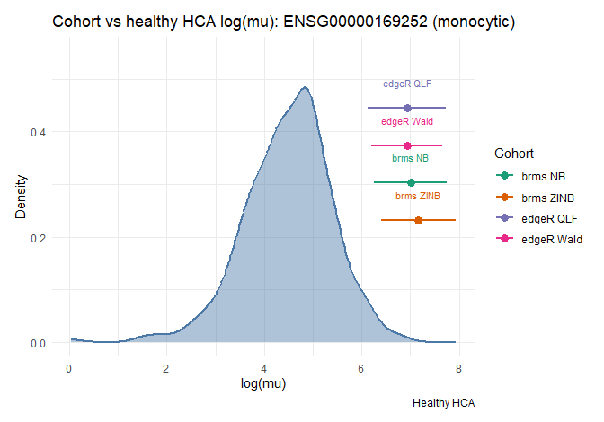
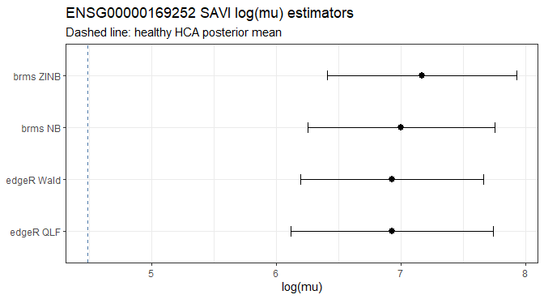

Cohort expression workflow (brms test)
================
Chen Zhan
2026-09-09

SAVI case study: *ADRB2* (`ENSG00000169252`) in disease-associated
monocytes.

Same analysis as `vignette("cohort-expression-edger-native")`, with an
extra user-side Bayesian step: fit `brms` negative binomial (NB) and
zero-inflated NB (ZINB) models on the same formula / offset as edgeR,
then summarise SAVI `posterior_linpred` draws exactly as the HCA
baseline path does (`mean` → `log_mu`, `sd` → `se`).

``` text
USER + HCA counts
  → TMMwsp
  → offset = log(E_user)
  → edgeR: glmQLFit → CategorySAVI → QLF SE / package Wald SE
  → brms NB / ZINB: counts ~ 1 + Category + offset(hca_offset)
  → linpred(newdata = SAVI, ndraws = 400) → log_mu, se
  → + log(E_HCA) for edgeR absolute scale
  → compare all estimates to HCA posterior
```

`brms` fitting chunks require `cmdstanr` with a working CmdStan
installation. Without that, the edgeR comparison still runs.

## Setup

``` r
library(posteriorHCA)
library(Seurat)
library(AnnotationDbi)
library(org.Hs.eg.db)
library(edgeR)
library(limma)
library(brms)
library(dplyr)
library(forcats)
library(tibble)

cell_type <- "monocytic"
gene <- "ENSG00000169252"
n_chains <- 2L
n_warmup <- 400L
n_iter <- 600L
n_linpred_draws <- 400L
```

## Counts

``` r
data(savi_mono)

counts <- as.matrix(Seurat::GetAssayData(savi_mono, layer = "counts"))
ensembl <- AnnotationDbi::mapIds(
  org.Hs.eg.db,
  keys = rownames(counts),
  column = "ENSEMBL",
  keytype = "SYMBOL",
  multiVals = "first"
)
ok <- !is.na(ensembl) & !duplicated(ensembl)
counts <- counts[ok, , drop = FALSE]
rownames(counts) <- unname(ensembl[ok])

meta <- data.frame(
  Category = factor(savi_mono$Category[colnames(counts)]),
  Experiment = factor(savi_mono$Experiment[colnames(counts)]),
  row.names = colnames(counts)
)
table(meta$Category, meta$Experiment)
#>               
#>                EXP1 EXP2 EXP3
#>   CTRL            3    2    2
#>   SAVI            2    2    1
#>   SAVI_treated    3    2    0
```

## HCA reference

``` r
ref <- load_reference_sample(cell_type)
ref_id <- ref$sample_id

counts <- merge_with_reference_sample(
  counts,
  reference = ref$counts,
  reference_name = ref_id
)
```

The reference is only for joint TMM. Drop it before fitting.

## TMMwsp scaling

``` r
nf <- calcNormFactors(counts, refColumn = match(ref_id, colnames(counts)), method = "TMMwsp")
eff <- colSums(counts) * nf

user <- setdiff(colnames(counts), ref_id)
log_E <- log(eff[user])
log_E_hca <- log(eff[[ref_id]])
hca_offset <- log(eff[user] / eff[[ref_id]])
```

## USER edgeR model

``` r
y <- counts[, user, drop = FALSE]
meta <- meta[user, , drop = FALSE] |>
  mutate(Category = fct_relevel(Category, "CTRL"))

offset <- matrix(log_E, nrow = nrow(y), ncol = ncol(y), byrow = TRUE)
design <- model.matrix(~ 1 + Category, data = meta)
colnames(design)
#> [1] "(Intercept)"          "CategorySAVI"         "CategorySAVI_treated"

fit <- glmQLFit(y, design = design, offset = offset, prior.count = 0, robust = TRUE)

contrast <- makeContrasts('(Intercept) + CategorySAVI', levels = design)
contrast
#>                       Contrasts
#> Levels                 (Intercept) + CategorySAVI
#>   Intercept                                     1
#>   CategorySAVI                                  1
#>   CategorySAVI_treated                          0
```

`CategorySAVI` is the SAVI effect under `~ 1 + Category` (CTRL
reference).

## Estimate and QLF-implied SE

`glmQLFTest()` reports `logFC` on the log2 scale. Convert to natural
log. The SE below is implied by the one-dimensional QL F statistic, not
a coefficient-covariance SE.

``` r
qlf <- glmQLFTest(fit, contrast = contrast)
tab <- qlf$table[gene, ]

estimate <- tab$logFC * log(2)
se_qlf <- abs(tab$logFC) / sqrt(tab$F) * log(2)

# Absolute estimand → place on HCA scale (SE unchanged).
log_mu <- estimate + log_E_hca
n_savi <- sum(meta$Category == "SAVI")
beta_start <- as.numeric(fit$coefficients[gene, ])

data.frame(gene, estimate, log_mu, se_qlf, n = n_savi)
#>              gene  estimate   log_mu    se_qlf n
#> 1 ENSG00000169252 -8.204858 6.929635 0.8109417 5
```

## Package Wald SE (for comparison)

``` r
wald <- estimate_ql(
  counts = y,
  offset = log_E,
  metadata = meta,
  formula = ~ 1 + Category,
  contrast = "CategorySAVI"
)
wald <- wald[wald$gene == gene, ]
se_wald <- wald$se

data.frame(
  estimate_qlf = estimate,
  estimate_wald = wald$estimate,
  se_qlf,
  se_wald,
  se_ratio = se_qlf / se_wald
)
#>   estimate_qlf estimate_wald    se_qlf  se_wald se_ratio
#> 1    -8.204858      3.626716 0.8109417 0.732846 1.106565
```

## USER brms models (NB and ZINB)

Same mean structure as edgeR: `~ 1 + Category` with posteriorHCA offset.

``` r
df_gene <- data.frame(
  counts = as.integer(y[gene, ]),
  Category = meta$Category,
  hca_offset = as.numeric(hca_offset),
  row.names = colnames(y)
) |>
  mutate(Category = fct_relevel(Category, "CTRL"))

make_inits <- function(zi = FALSE) {
  force(zi)
  function(chain_id = 1) {
    set.seed(1000L + as.integer(chain_id) + if (zi) 50L else 0L)
    out <- list(
      b = as.array(beta_start + stats::rnorm(length(beta_start), 0, 0.05)),
      shape = max(5 + stats::rnorm(1, 0, 0.1), 0.5)
    )
    if (isTRUE(zi)) {
      out$Intercept_zi <- -2 + stats::rnorm(1, 0, 0.1)
    }
    out
  }
}

inits <- make_inits(zi = FALSE)
inits_zi <- make_inits(zi = TRUE)

form_nb <- counts ~ 1 + Category + offset(hca_offset)
form_zinb <- brms::bf(counts ~ 1 + Category + offset(hca_offset), zi ~ 1)
```

``` r
fit_nb <- brms::brm(
  formula = form_nb,
  data = df_gene,
  family = brms::negbinomial(),
  chains = n_chains,
  warmup = n_warmup,
  iter = n_iter,
  refresh = 10,
  backend = "cmdstanr",
  seed = 1
)
#> Running MCMC with 2 sequential chains...
#> 
#> Chain 1 Iteration:   1 / 600 [  0%]  (Warmup) 
#> Chain 1 Iteration:  10 / 600 [  1%]  (Warmup) 
#> Chain 1 Iteration:  20 / 600 [  3%]  (Warmup) 
#> Chain 1 Iteration:  30 / 600 [  5%]  (Warmup) 
#> Chain 1 Iteration:  40 / 600 [  6%]  (Warmup) 
#> Chain 1 Iteration:  50 / 600 [  8%]  (Warmup) 
#> Chain 1 Iteration:  60 / 600 [ 10%]  (Warmup) 
#> Chain 1 Iteration:  70 / 600 [ 11%]  (Warmup) 
#> Chain 1 Iteration:  80 / 600 [ 13%]  (Warmup) 
#> Chain 1 Iteration:  90 / 600 [ 15%]  (Warmup) 
#> Chain 1 Iteration: 100 / 600 [ 16%]  (Warmup) 
#> Chain 1 Iteration: 110 / 600 [ 18%]  (Warmup) 
#> Chain 1 Iteration: 120 / 600 [ 20%]  (Warmup) 
#> Chain 1 Iteration: 130 / 600 [ 21%]  (Warmup) 
#> Chain 1 Iteration: 140 / 600 [ 23%]  (Warmup) 
#> Chain 1 Iteration: 150 / 600 [ 25%]  (Warmup) 
#> Chain 1 Iteration: 160 / 600 [ 26%]  (Warmup) 
#> Chain 1 Iteration: 170 / 600 [ 28%]  (Warmup) 
#> Chain 1 Iteration: 180 / 600 [ 30%]  (Warmup) 
#> Chain 1 Iteration: 190 / 600 [ 31%]  (Warmup) 
#> Chain 1 Iteration: 200 / 600 [ 33%]  (Warmup) 
#> Chain 1 Iteration: 210 / 600 [ 35%]  (Warmup) 
#> Chain 1 Iteration: 220 / 600 [ 36%]  (Warmup) 
#> Chain 1 Iteration: 230 / 600 [ 38%]  (Warmup) 
#> Chain 1 Iteration: 240 / 600 [ 40%]  (Warmup) 
#> Chain 1 Iteration: 250 / 600 [ 41%]  (Warmup) 
#> Chain 1 Iteration: 260 / 600 [ 43%]  (Warmup) 
#> Chain 1 Iteration: 270 / 600 [ 45%]  (Warmup) 
#> Chain 1 Iteration: 280 / 600 [ 46%]  (Warmup) 
#> Chain 1 Iteration: 290 / 600 [ 48%]  (Warmup) 
#> Chain 1 Iteration: 300 / 600 [ 50%]  (Warmup) 
#> Chain 1 Iteration: 310 / 600 [ 51%]  (Warmup) 
#> Chain 1 Iteration: 320 / 600 [ 53%]  (Warmup) 
#> Chain 1 Iteration: 330 / 600 [ 55%]  (Warmup) 
#> Chain 1 Iteration: 340 / 600 [ 56%]  (Warmup) 
#> Chain 1 Iteration: 350 / 600 [ 58%]  (Warmup) 
#> Chain 1 Iteration: 360 / 600 [ 60%]  (Warmup) 
#> Chain 1 Iteration: 370 / 600 [ 61%]  (Warmup) 
#> Chain 1 Iteration: 380 / 600 [ 63%]  (Warmup) 
#> Chain 1 Iteration: 390 / 600 [ 65%]  (Warmup) 
#> Chain 1 Iteration: 400 / 600 [ 66%]  (Warmup) 
#> Chain 1 Iteration: 401 / 600 [ 66%]  (Sampling) 
#> Chain 1 Iteration: 410 / 600 [ 68%]  (Sampling) 
#> Chain 1 Iteration: 420 / 600 [ 70%]  (Sampling) 
#> Chain 1 Iteration: 430 / 600 [ 71%]  (Sampling) 
#> Chain 1 Iteration: 440 / 600 [ 73%]  (Sampling) 
#> Chain 1 Iteration: 450 / 600 [ 75%]  (Sampling) 
#> Chain 1 Iteration: 460 / 600 [ 76%]  (Sampling) 
#> Chain 1 Iteration: 470 / 600 [ 78%]  (Sampling) 
#> Chain 1 Iteration: 480 / 600 [ 80%]  (Sampling) 
#> Chain 1 Iteration: 490 / 600 [ 81%]  (Sampling) 
#> Chain 1 Iteration: 500 / 600 [ 83%]  (Sampling) 
#> Chain 1 Iteration: 510 / 600 [ 85%]  (Sampling) 
#> Chain 1 Iteration: 520 / 600 [ 86%]  (Sampling) 
#> Chain 1 Iteration: 530 / 600 [ 88%]  (Sampling) 
#> Chain 1 Iteration: 540 / 600 [ 90%]  (Sampling) 
#> Chain 1 Iteration: 550 / 600 [ 91%]  (Sampling) 
#> Chain 1 Iteration: 560 / 600 [ 93%]  (Sampling) 
#> Chain 1 Iteration: 570 / 600 [ 95%]  (Sampling) 
#> Chain 1 Iteration: 580 / 600 [ 96%]  (Sampling) 
#> Chain 1 Iteration: 590 / 600 [ 98%]  (Sampling) 
#> Chain 1 Iteration: 600 / 600 [100%]  (Sampling) 
#> Chain 1 finished in 0.0 seconds.
#> Chain 2 Iteration:   1 / 600 [  0%]  (Warmup) 
#> Chain 2 Iteration:  10 / 600 [  1%]  (Warmup) 
#> Chain 2 Iteration:  20 / 600 [  3%]  (Warmup) 
#> Chain 2 Iteration:  30 / 600 [  5%]  (Warmup) 
#> Chain 2 Iteration:  40 / 600 [  6%]  (Warmup) 
#> Chain 2 Iteration:  50 / 600 [  8%]  (Warmup) 
#> Chain 2 Iteration:  60 / 600 [ 10%]  (Warmup) 
#> Chain 2 Iteration:  70 / 600 [ 11%]  (Warmup) 
#> Chain 2 Iteration:  80 / 600 [ 13%]  (Warmup) 
#> Chain 2 Iteration:  90 / 600 [ 15%]  (Warmup) 
#> Chain 2 Iteration: 100 / 600 [ 16%]  (Warmup) 
#> Chain 2 Iteration: 110 / 600 [ 18%]  (Warmup) 
#> Chain 2 Iteration: 120 / 600 [ 20%]  (Warmup) 
#> Chain 2 Iteration: 130 / 600 [ 21%]  (Warmup) 
#> Chain 2 Iteration: 140 / 600 [ 23%]  (Warmup) 
#> Chain 2 Iteration: 150 / 600 [ 25%]  (Warmup) 
#> Chain 2 Iteration: 160 / 600 [ 26%]  (Warmup) 
#> Chain 2 Iteration: 170 / 600 [ 28%]  (Warmup) 
#> Chain 2 Iteration: 180 / 600 [ 30%]  (Warmup) 
#> Chain 2 Iteration: 190 / 600 [ 31%]  (Warmup) 
#> Chain 2 Iteration: 200 / 600 [ 33%]  (Warmup) 
#> Chain 2 Iteration: 210 / 600 [ 35%]  (Warmup) 
#> Chain 2 Iteration: 220 / 600 [ 36%]  (Warmup) 
#> Chain 2 Iteration: 230 / 600 [ 38%]  (Warmup) 
#> Chain 2 Iteration: 240 / 600 [ 40%]  (Warmup) 
#> Chain 2 Iteration: 250 / 600 [ 41%]  (Warmup) 
#> Chain 2 Iteration: 260 / 600 [ 43%]  (Warmup) 
#> Chain 2 Iteration: 270 / 600 [ 45%]  (Warmup) 
#> Chain 2 Iteration: 280 / 600 [ 46%]  (Warmup) 
#> Chain 2 Iteration: 290 / 600 [ 48%]  (Warmup) 
#> Chain 2 Iteration: 300 / 600 [ 50%]  (Warmup) 
#> Chain 2 Iteration: 310 / 600 [ 51%]  (Warmup) 
#> Chain 2 Iteration: 320 / 600 [ 53%]  (Warmup) 
#> Chain 2 Iteration: 330 / 600 [ 55%]  (Warmup) 
#> Chain 2 Iteration: 340 / 600 [ 56%]  (Warmup) 
#> Chain 2 Iteration: 350 / 600 [ 58%]  (Warmup) 
#> Chain 2 Iteration: 360 / 600 [ 60%]  (Warmup) 
#> Chain 2 Iteration: 370 / 600 [ 61%]  (Warmup) 
#> Chain 2 Iteration: 380 / 600 [ 63%]  (Warmup) 
#> Chain 2 Iteration: 390 / 600 [ 65%]  (Warmup) 
#> Chain 2 Iteration: 400 / 600 [ 66%]  (Warmup) 
#> Chain 2 Iteration: 401 / 600 [ 66%]  (Sampling) 
#> Chain 2 Iteration: 410 / 600 [ 68%]  (Sampling) 
#> Chain 2 Iteration: 420 / 600 [ 70%]  (Sampling) 
#> Chain 2 Iteration: 430 / 600 [ 71%]  (Sampling) 
#> Chain 2 Iteration: 440 / 600 [ 73%]  (Sampling) 
#> Chain 2 Iteration: 450 / 600 [ 75%]  (Sampling) 
#> Chain 2 Iteration: 460 / 600 [ 76%]  (Sampling) 
#> Chain 2 Iteration: 470 / 600 [ 78%]  (Sampling) 
#> Chain 2 Iteration: 480 / 600 [ 80%]  (Sampling) 
#> Chain 2 Iteration: 490 / 600 [ 81%]  (Sampling) 
#> Chain 2 Iteration: 500 / 600 [ 83%]  (Sampling) 
#> Chain 2 Iteration: 510 / 600 [ 85%]  (Sampling) 
#> Chain 2 Iteration: 520 / 600 [ 86%]  (Sampling) 
#> Chain 2 Iteration: 530 / 600 [ 88%]  (Sampling) 
#> Chain 2 Iteration: 540 / 600 [ 90%]  (Sampling) 
#> Chain 2 Iteration: 550 / 600 [ 91%]  (Sampling) 
#> Chain 2 Iteration: 560 / 600 [ 93%]  (Sampling) 
#> Chain 2 Iteration: 570 / 600 [ 95%]  (Sampling) 
#> Chain 2 Iteration: 580 / 600 [ 96%]  (Sampling) 
#> Chain 2 Iteration: 590 / 600 [ 98%]  (Sampling) 
#> Chain 2 Iteration: 600 / 600 [100%]  (Sampling) 
#> Chain 2 finished in 0.0 seconds.
#> 
#> Both chains finished successfully.
#> Mean chain execution time: 0.0 seconds.
#> Total execution time: 0.3 seconds.
fit_nb
#>  Family: negbinomial 
#>   Links: mu = log 
#> Formula: counts ~ 1 + Category + offset(hca_offset) 
#>    Data: df_gene (Number of observations: 17) 
#>   Draws: 2 chains, each with iter = 600; warmup = 400; thin = 1;
#>          total post-warmup draws = 400
#> 
#> Regression Coefficients:
#>                      Estimate Est.Error l-95% CI u-95% CI Rhat Bulk_ESS
#> Intercept                3.25      0.75     1.96     4.87 1.01      163
#> CategorySAVI             3.75      1.07     1.67     5.96 1.01      190
#> CategorySAVI_treated     3.19      1.10     1.19     5.27 1.01      203
#>                      Tail_ESS
#> Intercept                 138
#> CategorySAVI              185
#> CategorySAVI_treated      198
#> 
#> Further Distributional Parameters:
#>       Estimate Est.Error l-95% CI u-95% CI Rhat Bulk_ESS Tail_ESS
#> shape     0.51      0.21     0.19     1.04 1.00      264      205
#> 
#> Draws were sampled using sample(hmc). For each parameter, Bulk_ESS
#> and Tail_ESS are effective sample size measures, and Rhat is the potential
#> scale reduction factor on split chains (at convergence, Rhat = 1).
```

``` r
fit_zinb <- brms::brm(
  formula = form_zinb,
  data = df_gene,
  family = brms::zero_inflated_negbinomial(),
  chains = n_chains,
  warmup = n_warmup,
  iter = n_iter,
  refresh = 10,
  backend = "cmdstanr",
  seed = 2
)
#> Running MCMC with 2 sequential chains...
#> 
#> Chain 1 Iteration:   1 / 600 [  0%]  (Warmup) 
#> Chain 1 Iteration:  10 / 600 [  1%]  (Warmup) 
#> Chain 1 Iteration:  20 / 600 [  3%]  (Warmup) 
#> Chain 1 Iteration:  30 / 600 [  5%]  (Warmup) 
#> Chain 1 Iteration:  40 / 600 [  6%]  (Warmup) 
#> Chain 1 Iteration:  50 / 600 [  8%]  (Warmup) 
#> Chain 1 Iteration:  60 / 600 [ 10%]  (Warmup) 
#> Chain 1 Iteration:  70 / 600 [ 11%]  (Warmup) 
#> Chain 1 Iteration:  80 / 600 [ 13%]  (Warmup) 
#> Chain 1 Iteration:  90 / 600 [ 15%]  (Warmup) 
#> Chain 1 Iteration: 100 / 600 [ 16%]  (Warmup) 
#> Chain 1 Iteration: 110 / 600 [ 18%]  (Warmup) 
#> Chain 1 Iteration: 120 / 600 [ 20%]  (Warmup) 
#> Chain 1 Iteration: 130 / 600 [ 21%]  (Warmup) 
#> Chain 1 Iteration: 140 / 600 [ 23%]  (Warmup) 
#> Chain 1 Iteration: 150 / 600 [ 25%]  (Warmup) 
#> Chain 1 Iteration: 160 / 600 [ 26%]  (Warmup) 
#> Chain 1 Iteration: 170 / 600 [ 28%]  (Warmup) 
#> Chain 1 Iteration: 180 / 600 [ 30%]  (Warmup) 
#> Chain 1 Iteration: 190 / 600 [ 31%]  (Warmup) 
#> Chain 1 Iteration: 200 / 600 [ 33%]  (Warmup) 
#> Chain 1 Iteration: 210 / 600 [ 35%]  (Warmup) 
#> Chain 1 Iteration: 220 / 600 [ 36%]  (Warmup) 
#> Chain 1 Iteration: 230 / 600 [ 38%]  (Warmup) 
#> Chain 1 Iteration: 240 / 600 [ 40%]  (Warmup) 
#> Chain 1 Iteration: 250 / 600 [ 41%]  (Warmup) 
#> Chain 1 Iteration: 260 / 600 [ 43%]  (Warmup) 
#> Chain 1 Iteration: 270 / 600 [ 45%]  (Warmup) 
#> Chain 1 Iteration: 280 / 600 [ 46%]  (Warmup) 
#> Chain 1 Iteration: 290 / 600 [ 48%]  (Warmup) 
#> Chain 1 Iteration: 300 / 600 [ 50%]  (Warmup) 
#> Chain 1 Iteration: 310 / 600 [ 51%]  (Warmup) 
#> Chain 1 Iteration: 320 / 600 [ 53%]  (Warmup) 
#> Chain 1 Iteration: 330 / 600 [ 55%]  (Warmup) 
#> Chain 1 Iteration: 340 / 600 [ 56%]  (Warmup) 
#> Chain 1 Iteration: 350 / 600 [ 58%]  (Warmup) 
#> Chain 1 Iteration: 360 / 600 [ 60%]  (Warmup) 
#> Chain 1 Iteration: 370 / 600 [ 61%]  (Warmup) 
#> Chain 1 Iteration: 380 / 600 [ 63%]  (Warmup) 
#> Chain 1 Iteration: 390 / 600 [ 65%]  (Warmup) 
#> Chain 1 Iteration: 400 / 600 [ 66%]  (Warmup) 
#> Chain 1 Iteration: 401 / 600 [ 66%]  (Sampling) 
#> Chain 1 Iteration: 410 / 600 [ 68%]  (Sampling) 
#> Chain 1 Iteration: 420 / 600 [ 70%]  (Sampling) 
#> Chain 1 Iteration: 430 / 600 [ 71%]  (Sampling) 
#> Chain 1 Iteration: 440 / 600 [ 73%]  (Sampling) 
#> Chain 1 Iteration: 450 / 600 [ 75%]  (Sampling) 
#> Chain 1 Iteration: 460 / 600 [ 76%]  (Sampling) 
#> Chain 1 Iteration: 470 / 600 [ 78%]  (Sampling) 
#> Chain 1 Iteration: 480 / 600 [ 80%]  (Sampling) 
#> Chain 1 Iteration: 490 / 600 [ 81%]  (Sampling) 
#> Chain 1 Iteration: 500 / 600 [ 83%]  (Sampling) 
#> Chain 1 Iteration: 510 / 600 [ 85%]  (Sampling) 
#> Chain 1 Iteration: 520 / 600 [ 86%]  (Sampling) 
#> Chain 1 Iteration: 530 / 600 [ 88%]  (Sampling) 
#> Chain 1 Iteration: 540 / 600 [ 90%]  (Sampling) 
#> Chain 1 Iteration: 550 / 600 [ 91%]  (Sampling) 
#> Chain 1 Iteration: 560 / 600 [ 93%]  (Sampling) 
#> Chain 1 Iteration: 570 / 600 [ 95%]  (Sampling) 
#> Chain 1 Iteration: 580 / 600 [ 96%]  (Sampling) 
#> Chain 1 Iteration: 590 / 600 [ 98%]  (Sampling) 
#> Chain 1 Iteration: 600 / 600 [100%]  (Sampling) 
#> Chain 1 finished in 0.1 seconds.
#> Chain 2 Iteration:   1 / 600 [  0%]  (Warmup) 
#> Chain 2 Iteration:  10 / 600 [  1%]  (Warmup) 
#> Chain 2 Iteration:  20 / 600 [  3%]  (Warmup) 
#> Chain 2 Iteration:  30 / 600 [  5%]  (Warmup) 
#> Chain 2 Iteration:  40 / 600 [  6%]  (Warmup) 
#> Chain 2 Iteration:  50 / 600 [  8%]  (Warmup) 
#> Chain 2 Iteration:  60 / 600 [ 10%]  (Warmup) 
#> Chain 2 Iteration:  70 / 600 [ 11%]  (Warmup) 
#> Chain 2 Iteration:  80 / 600 [ 13%]  (Warmup) 
#> Chain 2 Iteration:  90 / 600 [ 15%]  (Warmup) 
#> Chain 2 Iteration: 100 / 600 [ 16%]  (Warmup) 
#> Chain 2 Iteration: 110 / 600 [ 18%]  (Warmup) 
#> Chain 2 Iteration: 120 / 600 [ 20%]  (Warmup) 
#> Chain 2 Iteration: 130 / 600 [ 21%]  (Warmup) 
#> Chain 2 Iteration: 140 / 600 [ 23%]  (Warmup) 
#> Chain 2 Iteration: 150 / 600 [ 25%]  (Warmup) 
#> Chain 2 Iteration: 160 / 600 [ 26%]  (Warmup) 
#> Chain 2 Iteration: 170 / 600 [ 28%]  (Warmup) 
#> Chain 2 Iteration: 180 / 600 [ 30%]  (Warmup) 
#> Chain 2 Iteration: 190 / 600 [ 31%]  (Warmup) 
#> Chain 2 Iteration: 200 / 600 [ 33%]  (Warmup) 
#> Chain 2 Iteration: 210 / 600 [ 35%]  (Warmup) 
#> Chain 2 Iteration: 220 / 600 [ 36%]  (Warmup) 
#> Chain 2 Iteration: 230 / 600 [ 38%]  (Warmup) 
#> Chain 2 Iteration: 240 / 600 [ 40%]  (Warmup) 
#> Chain 2 Iteration: 250 / 600 [ 41%]  (Warmup) 
#> Chain 2 Iteration: 260 / 600 [ 43%]  (Warmup) 
#> Chain 2 Iteration: 270 / 600 [ 45%]  (Warmup) 
#> Chain 2 Iteration: 280 / 600 [ 46%]  (Warmup) 
#> Chain 2 Iteration: 290 / 600 [ 48%]  (Warmup) 
#> Chain 2 Iteration: 300 / 600 [ 50%]  (Warmup) 
#> Chain 2 Iteration: 310 / 600 [ 51%]  (Warmup) 
#> Chain 2 Iteration: 320 / 600 [ 53%]  (Warmup) 
#> Chain 2 Iteration: 330 / 600 [ 55%]  (Warmup) 
#> Chain 2 Iteration: 340 / 600 [ 56%]  (Warmup) 
#> Chain 2 Iteration: 350 / 600 [ 58%]  (Warmup) 
#> Chain 2 Iteration: 360 / 600 [ 60%]  (Warmup) 
#> Chain 2 Iteration: 370 / 600 [ 61%]  (Warmup) 
#> Chain 2 Iteration: 380 / 600 [ 63%]  (Warmup) 
#> Chain 2 Iteration: 390 / 600 [ 65%]  (Warmup) 
#> Chain 2 Iteration: 400 / 600 [ 66%]  (Warmup) 
#> Chain 2 Iteration: 401 / 600 [ 66%]  (Sampling) 
#> Chain 2 Iteration: 410 / 600 [ 68%]  (Sampling) 
#> Chain 2 Iteration: 420 / 600 [ 70%]  (Sampling) 
#> Chain 2 Iteration: 430 / 600 [ 71%]  (Sampling) 
#> Chain 2 Iteration: 440 / 600 [ 73%]  (Sampling) 
#> Chain 2 Iteration: 450 / 600 [ 75%]  (Sampling) 
#> Chain 2 Iteration: 460 / 600 [ 76%]  (Sampling) 
#> Chain 2 Iteration: 470 / 600 [ 78%]  (Sampling) 
#> Chain 2 Iteration: 480 / 600 [ 80%]  (Sampling) 
#> Chain 2 Iteration: 490 / 600 [ 81%]  (Sampling) 
#> Chain 2 Iteration: 500 / 600 [ 83%]  (Sampling) 
#> Chain 2 Iteration: 510 / 600 [ 85%]  (Sampling) 
#> Chain 2 Iteration: 520 / 600 [ 86%]  (Sampling) 
#> Chain 2 Iteration: 530 / 600 [ 88%]  (Sampling) 
#> Chain 2 Iteration: 540 / 600 [ 90%]  (Sampling) 
#> Chain 2 Iteration: 550 / 600 [ 91%]  (Sampling) 
#> Chain 2 Iteration: 560 / 600 [ 93%]  (Sampling) 
#> Chain 2 Iteration: 570 / 600 [ 95%]  (Sampling) 
#> Chain 2 Iteration: 580 / 600 [ 96%]  (Sampling) 
#> Chain 2 Iteration: 590 / 600 [ 98%]  (Sampling) 
#> Chain 2 Iteration: 600 / 600 [100%]  (Sampling) 
#> Chain 2 finished in 0.1 seconds.
#> 
#> Both chains finished successfully.
#> Mean chain execution time: 0.1 seconds.
#> Total execution time: 0.3 seconds.
fit_zinb
#>  Family: zero_inflated_negbinomial 
#>   Links: mu = log; zi = logit 
#> Formula: counts ~ 1 + Category + offset(hca_offset) 
#>          zi ~ 1
#>    Data: df_gene (Number of observations: 17) 
#>   Draws: 2 chains, each with iter = 600; warmup = 400; thin = 1;
#>          total post-warmup draws = 400
#> 
#> Regression Coefficients:
#>                      Estimate Est.Error l-95% CI u-95% CI Rhat Bulk_ESS
#> Intercept                3.38      0.78     2.03     4.98 1.00      210
#> zi_Intercept            -2.21      1.04    -4.36    -0.57 1.00      387
#> CategorySAVI             3.78      1.11     1.52     5.84 1.01      229
#> CategorySAVI_treated     3.07      1.07     0.92     5.30 1.00      236
#>                      Tail_ESS
#> Intercept                 254
#> zi_Intercept              234
#> CategorySAVI              252
#> CategorySAVI_treated      226
#> 
#> Further Distributional Parameters:
#>       Estimate Est.Error l-95% CI u-95% CI Rhat Bulk_ESS Tail_ESS
#> shape     0.58      0.26     0.23     1.20 1.00      260      308
#> 
#> Draws were sampled using sample(hmc). For each parameter, Bulk_ESS
#> and Tail_ESS are effective sample size measures, and Rhat is the potential
#> scale reduction factor on split chains (at convergence, Rhat = 1).
```

### SAVI linpred → log_mu / se

Mirror the HCA baseline path: `posterior_linpred` (latent log μ), then
`summarize_posterior_draws()` (`mean` / `sd`). Query SAVI at
`hca_offset = 0`.

``` r
summarise_savi_linpred <- function(fit, newdata, ndraws) {
  draws_mat <- brms::posterior_linpred(
    fit,
    newdata = newdata,
    transform = FALSE,
    ndraws = ndraws
  )
  draws <- as.numeric(draws_mat)
  summarize_posterior_draws(draws)
}

newdata_brms <- list(Category = "SAVI", hca_offset = 0) |> as_tibble()

nb_savi <- summarise_savi_linpred(fit_nb, newdata_brms, n_linpred_draws)
zinb_savi <- summarise_savi_linpred(fit_zinb, newdata_brms, n_linpred_draws)

data.frame(
  method = c("brms NB", "brms ZINB"),
  log_mu = c(nb_savi$log_mu, zinb_savi$log_mu),
  se = c(nb_savi$se, zinb_savi$se),
  n_draws = c(nb_savi$n, zinb_savi$n)
)
#>      method   log_mu        se n_draws
#> 1   brms NB 7.003428 0.7529865     400
#> 2 brms ZINB 7.166871 0.7607443     400
```

## HCA posterior

``` r
fit_hca <- load_expression_fit(cell_type = cell_type, gene_ensg = gene)
newdata <- build_newdata_grid(
  fit_hca,
  disease_groups = "Normal",
  tissue_groups = "blood",
  assay_groups = "10x Genomics 3"
)
draws <- expression_draws(fit_hca, newdata = newdata, quantity = "linpred", marginalise = "mean")
hca <- summarize_posterior_draws(draws, value = log_mu)
```

## Welch tests (all methods)

Same HCA baseline; cohort rows differ by estimator / SE.

``` r
welch_one <- function(mu1, se1) {
  welch_test_means(
    mu1 = mu1, se1 = se1,
    mu2 = hca$log_mu, se2 = hca$se,
    n1 = n_savi, n2 = hca$n
  )
}

cohort <- data.frame(
  group = c("edgeR QLF", "edgeR Wald"),
  n = n_savi,
  log_mu = c(log_mu, log_mu),
  se = c(se_qlf, se_wald),
  hca_log_mu = hca$log_mu,
  hca_se = hca$se,
  p_value = c(
    welch_one(log_mu, se_qlf)$p_value,
    welch_one(log_mu, se_wald)$p_value
  )
)

if (isTRUE(can_fit_brms)) {
  cohort <- rbind(
    cohort,
    data.frame(
      group = c("brms NB", "brms ZINB"),
      n = n_savi,
      log_mu = c(nb_savi$log_mu, zinb_savi$log_mu),
      se = c(nb_savi$se, zinb_savi$se),
      hca_log_mu = hca$log_mu,
      hca_se = hca$se,
      p_value = c(
        welch_one(nb_savi$log_mu, nb_savi$se)$p_value,
        welch_one(zinb_savi$log_mu, zinb_savi$se)$p_value
      )
    )
  )
}

cohort
#>        group n   log_mu        se hca_log_mu    hca_se    p_value
#> 1  edgeR QLF 5 6.929635 0.8109417   4.485295 0.8947568 0.05695681
#> 2 edgeR Wald 5 6.929635 0.7328460   4.485295 0.8947568 0.04502687
#> 3    brms NB 5 7.003428 0.7529865   4.485295 0.8947568 0.04210637
#> 4  brms ZINB 5 7.166871 0.7607443   4.485295 0.8947568 0.03229609
```

## Plots

``` r
plot_hca_draws(
  draws,
  query_mu = cohort$log_mu,
  query_SE = cohort$se,
  query_label = as.character(cohort$group)
)
```

<!-- -->

Point estimates and SEs side by side:

``` r
cohort$group <- factor(cohort$group, levels = cohort$group)
ggplot2::ggplot(cohort, ggplot2::aes(x = log_mu, y = group)) +
  ggplot2::geom_vline(xintercept = hca$log_mu, linetype = 2, colour = "#4C78A8") +
  ggplot2::geom_errorbarh(
    ggplot2::aes(xmin = log_mu - se, xmax = log_mu + se),
    height = 0.2
  ) +
  ggplot2::geom_point(size = 2.5) +
  ggplot2::labs(
    title = paste(gene, "SAVI log(mu) estimators"),
    subtitle = "Dashed line: healthy HCA posterior mean",
    x = "log(mu)",
    y = NULL
  ) +
  ggplot2::theme_bw()
```

<!-- -->

## Session info

``` r
sessionInfo()
#> R version 4.6.1 (2026-06-24 ucrt)
#> Platform: x86_64-w64-mingw32/x64
#> Running under: Windows 11 x64 (build 26200)
#> 
#> Matrix products: default
#>   LAPACK version 3.12.1
#> 
#> locale:
#> [1] LC_COLLATE=English_United Kingdom.utf8 
#> [2] LC_CTYPE=English_United Kingdom.utf8   
#> [3] LC_MONETARY=English_United Kingdom.utf8
#> [4] LC_NUMERIC=C                           
#> [5] LC_TIME=English_United Kingdom.utf8    
#> 
#> time zone: Australia/Adelaide
#> tzcode source: internal
#> 
#> attached base packages:
#> [1] stats4    stats     graphics  grDevices utils     datasets  methods  
#> [8] base     
#> 
#> other attached packages:
#>  [1] tibble_3.3.1         forcats_1.0.1        dplyr_1.2.1         
#>  [4] brms_2.23.0          Rcpp_1.1.2           edgeR_4.10.1        
#>  [7] limma_3.68.4         org.Hs.eg.db_3.23.1  AnnotationDbi_1.74.0
#> [10] IRanges_2.46.0       S4Vectors_0.50.1     Biobase_2.72.0      
#> [13] BiocGenerics_0.58.1  generics_0.1.4       Seurat_5.5.1        
#> [16] SeuratObject_5.4.0   sp_2.2-3             posteriorHCA_0.2.0  
#> [19] testthat_3.3.2      
#> 
#> loaded via a namespace (and not attached):
#>   [1] RcppAnnoy_0.0.23            splines_4.6.1              
#>   [3] later_1.4.8                 polyclip_1.10-7            
#>   [5] fastDummies_1.7.6           lifecycle_1.0.5            
#>   [7] StanHeaders_2.39.1          rprojroot_2.1.1            
#>   [9] vroom_1.7.1                 sccomp_2.4.0               
#>  [11] globals_0.19.1              processx_3.9.0             
#>  [13] lattice_0.22-9              MASS_7.3-65                
#>  [15] backports_1.5.1             magrittr_2.0.5             
#>  [17] plotly_4.12.1               rmarkdown_2.32             
#>  [19] yaml_2.3.12                 httpuv_1.6.17              
#>  [21] otel_0.2.0                  sctransform_0.4.3          
#>  [23] spam_2.11-4                 sessioninfo_1.2.4          
#>  [25] pkgbuild_1.4.8              spatstat.sparse_3.2-0      
#>  [27] reticulate_1.47.0           cowplot_1.2.0              
#>  [29] pbapply_1.7-5               DBI_1.3.0                  
#>  [31] RColorBrewer_1.1-3          pkgload_1.5.3              
#>  [33] multcomp_1.4-32             abind_1.4-8                
#>  [35] GenomicRanges_1.64.0        Rtsne_0.17                 
#>  [37] purrr_1.2.2                 TH.data_1.1-5              
#>  [39] tensorA_0.36.2.1            sandwich_3.1-3             
#>  [41] inline_0.3.21               ggrepel_0.9.8              
#>  [43] irlba_2.3.7                 listenv_1.0.0              
#>  [45] spatstat.utils_3.2-4        goftest_1.2-3              
#>  [47] RSpectra_0.16-2             spatstat.random_3.5-1      
#>  [49] bridgesampling_1.2-1        fitdistrplus_1.2-6         
#>  [51] parallelly_1.48.0           DelayedArray_0.38.2        
#>  [53] codetools_0.2-20            tidyselect_1.2.1           
#>  [55] bayesplot_1.16.0            farver_2.1.2               
#>  [57] matrixStats_1.5.0           spatstat.explore_3.8-2     
#>  [59] Seqinfo_1.2.0               jsonlite_2.0.0             
#>  [61] ellipsis_0.3.3              progressr_1.0.0            
#>  [63] ggridges_0.5.7              survival_3.8-6             
#>  [65] emmeans_2.0.4               tools_4.6.1                
#>  [67] ica_1.0-3                   glue_1.8.1                 
#>  [69] SparseArray_1.12.2          gridExtra_2.3.1            
#>  [71] qs2_0.3.1                   xfun_0.60                  
#>  [73] MatrixGenerics_1.24.0       usethis_3.2.1              
#>  [75] cmdstanr_0.9.0              distributional_0.8.1       
#>  [77] withr_3.0.3                 loo_2.10.1                 
#>  [79] instantiate_0.2.3           fastmap_1.2.0              
#>  [81] callr_3.8.0                 digest_0.6.39              
#>  [83] R6_2.6.1                    mime_0.13                  
#>  [85] estimability_2.0.0          scattermore_1.2            
#>  [87] tensor_1.5.1                spatstat.data_3.1-9        
#>  [89] RSQLite_3.53.3              tidyr_1.3.2                
#>  [91] data.table_1.18.6.1         S4Arrays_1.12.0            
#>  [93] httr_1.4.9                  htmlwidgets_1.6.4          
#>  [95] uwot_0.2.5                  pkgconfig_2.0.3            
#>  [97] gtable_0.3.6                blob_1.3.0                 
#>  [99] lmtest_0.9-40               S7_0.2.2                   
#> [101] SingleCellExperiment_1.34.0 XVector_0.52.0             
#> [103] brio_1.1.5                  htmltools_0.5.9            
#> [105] dotCall64_1.2               scales_1.4.0               
#> [107] png_0.1-9                   posterior_1.7.0            
#> [109] spatstat.univar_3.2-0       knitr_1.51                 
#> [111] rstudioapi_0.19.0           tzdb_0.5.0                 
#> [113] reshape2_1.4.5              coda_0.19-4.1              
#> [115] checkmate_2.3.4             nlme_3.1-169               
#> [117] cachem_1.1.0                zoo_1.9-0                  
#> [119] stringr_1.6.0               KernSmooth_2.23-26         
#> [121] parallel_4.6.1              miniUI_0.1.2               
#> [123] desc_1.4.3                  pillar_1.11.1              
#> [125] grid_4.6.1                  vctrs_0.7.3                
#> [127] RANN_2.6.3                  promises_1.5.0             
#> [129] stringfish_0.19.2           xtable_1.8-8               
#> [131] cluster_2.1.8.2             evaluate_1.0.5             
#> [133] readr_2.2.0                 mvtnorm_1.4-2              
#> [135] cli_3.6.6                   locfit_1.5-9.12            
#> [137] compiler_4.6.1              rlang_1.3.0                
#> [139] crayon_1.5.3                rstantools_2.7.1           
#> [141] future.apply_1.20.2         labeling_0.4.3             
#> [143] ps_1.9.3                    plyr_1.8.9                 
#> [145] fs_2.1.0                    rstan_2.32.7               
#> [147] stringi_1.8.9               QuickJSR_1.11.0            
#> [149] viridisLite_0.4.3           deldir_2.0-4               
#> [151] Biostrings_2.80.1           devtools_2.5.2             
#> [153] spatstat.geom_3.8-2         Brobdingnag_1.2-9          
#> [155] Matrix_1.7-5                RcppHNSW_0.7.0             
#> [157] hms_1.1.4                   patchwork_1.3.2            
#> [159] bit64_4.8.6                 future_1.75.0              
#> [161] ggplot2_4.0.3               KEGGREST_1.52.2            
#> [163] statmod_1.5.2               shiny_1.14.0               
#> [165] SummarizedExperiment_1.42.0 ROCR_1.0-12                
#> [167] igraph_2.3.3                memoise_2.0.1              
#> [169] RcppParallel_6.2.1          bit_4.6.0
```
