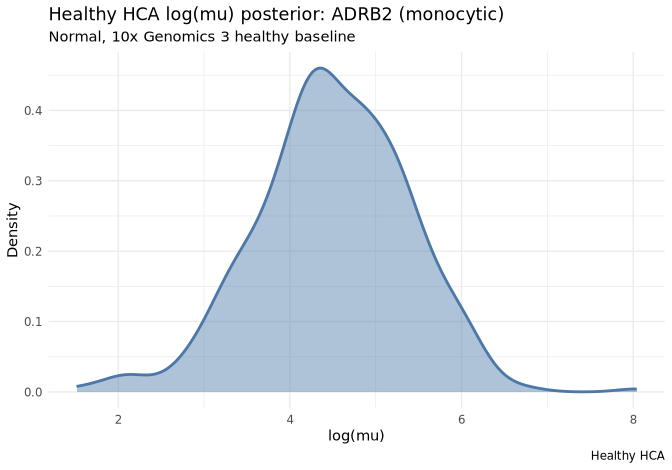
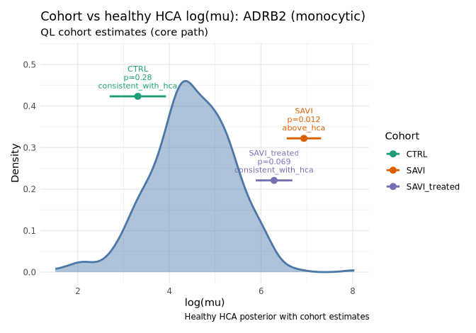

Cohort expression workflow (core)
================
Chen Zhan
2026-09-04

Matrix-level **core** path for the SAVI case study (*ADRB2* in
disease-associated monocytes, PBMC / blood). See
`vignette("cohort-expression-wrappers", package = "posteriorHCA")` for
the Seurat / formula wrapper path.

Steps:

0.  Align to one HCA reference library (`merge_with_reference_sample` +
    `calculate_tmm_offset`)  
1.  Estimate cohort log(μ) (`design_from_formula` +
    `estimate_logmu_ql`)  
2.  Load the healthy expression fit (`load_expr_fit`)  
3.  Draw the HCA baseline (`build_newdata_grid` + `expr_draws`)  
4.  Summarise the baseline at the cohort estimate
    (`summarize_posterior_draws`)  
5.  Welch test (`welch_test_means`)

## Setup

``` r
library(posteriorHCA)
library(Seurat)

cell_type <- "monocytic"
```

## Prepare `savi_mono`

``` r
data(savi_mono)
savi_mono <- harmonise_gene_ids(savi_mono, id_type = "auto")
dim(savi_mono)
#> [1] 17138    17
table(savi_mono$Category)
#> 
#>         CTRL         SAVI SAVI_treated 
#>            7            5            5
```

## Step 0. Align to the HCA monocytic reference

Reference sits at offset 0 (`offset = log(1 / multiplier)`).

``` r
ref <- load_reference_sample(cell_type)
user_mat <- as.matrix(Seurat::GetAssayData(savi_mono, layer = "counts"))

combined <- merge_with_reference_sample(
  user_mat,
  reference = ref$counts,
  reference_name = ref$sample_id
)
scaling <- calculate_tmm_offset(
  combined,
  reference_name = ref$sample_id,
  method = "TMMwsp"
)

c(
  n_genes = nrow(combined),
  n_samples = ncol(combined),
  reference_offset = unname(scaling$offset[[ref$sample_id]])
)
#>          n_genes        n_samples reference_offset 
#>             9625               18                0
```

## Step 1. Estimate cohort log(μ)

`estimate_logmu_ql()` fits **all genes** once (`glmQLFit` with
`prior.count = 0`). Filter afterwards for the gene of interest.

``` r
meta_core <- data.frame(
  Category = c(
    as.character(savi_mono$Category[colnames(user_mat)]),
    "reference"
  ),
  row.names = colnames(combined),
  stringsAsFactors = FALSE
)
meta_core$Category <- factor(meta_core$Category)

design <- design_from_formula(~ 0 + Category, meta_core)
est_all <- estimate_logmu_ql(
  counts = combined,
  offset = scaling$offset,
  design = design,
  cell_type = cell_type
)

gene_ensg <- resolve_gene_one("ADRB2", cell_type = cell_type)
est <- est_all[est_all$gene == gene_ensg, , drop = FALSE]
est$gene_symbol <- "ADRB2"
est
#>                  gene gene_symbol cell_type        group n   log_mu         mu
#> 2620  ENSG00000169252       ADRB2 monocytic         CTRL 7 3.313065   27.46918
#> 12245 ENSG00000169252       ADRB2 monocytic    reference 1 4.530958   92.84749
#> 21870 ENSG00000169252       ADRB2 monocytic         SAVI 5 6.937536 1030.22874
#> 31495 ENSG00000169252       ADRB2 monocytic SAVI_treated 5 6.286779  537.41932
#>              se       df dispersion
#> 2620  0.6154281 18.98187  0.2226158
#> 12245 0.8046448 18.98187  0.2226158
#> 21870 0.3751294 18.98187  0.2226158
#> 31495 0.3992543 18.98187  0.2226158
```

### Optional: single-cohort `~ 1`

Subset to one `Category`, fit with `design_from_formula(~ 1, ...)`, and
treat the intercept as that cohort’s absolute log(μ).

``` r
cats <- setdiff(levels(meta_core$Category), "reference")

est_by_level <- do.call(rbind, lapply(cats, function(x) {
  j <- which(meta_core$Category == x)
  design1 <- design_from_formula(~ 1, meta_core[j, , drop = FALSE])
  out <- estimate_logmu_ql(
    counts = combined[, j, drop = FALSE],
    offset = scaling$offset[j],
    design = design1,
    cell_type = cell_type
  )
  out <- out[out$gene == gene_ensg, , drop = FALSE]
  out$gene_symbol <- "ADRB2"
  out$group <- x
  out
}))
est_by_level
#>                  gene gene_symbol cell_type        group n   log_mu         mu
#> 2620  ENSG00000169252       ADRB2 monocytic         CTRL 7 3.334290   28.05845
#> 26201 ENSG00000169252       ADRB2 monocytic         SAVI 5 6.908769 1001.01467
#> 26202 ENSG00000169252       ADRB2 monocytic SAVI_treated 5 6.292121  540.29813
#>              se        df dispersion
#> 2620  0.3984058 10.899835  0.2300399
#> 26201 0.2621220  3.994552  0.3382149
#> 26202 0.2118680  3.953785  0.2076096
```

## Step 2. Load the healthy expression fit

``` r
fit <- load_expr_fit(cell_type = cell_type, gene = "ADRB2")
```

## Step 3. Draw the healthy HCA baseline

Covariates fixed to Normal / blood / 10x Genomics 3.
`quantity = "linpred"` is log(μ) on the natural-log scale.

``` r
grid <- build_newdata_grid(
  fit,
  disease_groups = "Normal",
  tissue_groups = "blood",
  assay_groups = "10x Genomics 3"
)

hca_res <- expr_draws(
  fit,
  newdata = grid,
  quantity = "linpred",
  collapse = "mean"
)

round(c(mean = mean(hca_res$draws), sd = sd(hca_res$draws)), 3)
#>  mean    sd 
#> 4.501 0.886
```

## Step 4. Summarise the baseline at the cohort estimate

``` r
cohort <- cohort_estimate_at(est, group = "SAVI")
baseline <- summarize_posterior_draws(hca_res, value = cohort$mu)
baseline
#> $mean
#> [1] 4.500582
#> 
#> $sd
#> [1] 0.8860326
#> 
#> $n
#> [1] 400
#> 
#> $empirical_rank
#> [1] 0.9975
```

## Step 5. Welch test

``` r
welch_test_means(
  cohort$mu, cohort$se,
  baseline$mean, baseline$sd,
  n1 = cohort$n, n2 = baseline$n
)
#> $mu1
#> [1] 6.937536
#> 
#> $se1
#> [1] 0.3751294
#> 
#> $n1
#> [1] 5
#> 
#> $mu2
#> [1] 4.500582
#> 
#> $se2
#> [1] 0.8860326
#> 
#> $n2
#> [1] 400
#> 
#> $delta
#> [1] 2.436955
#> 
#> $se_diff
#> [1] 0.9621724
#> 
#> $t_stat
#> [1] 2.532763
#> 
#> $df
#> [1] 131.9507
#> 
#> $p_value
#> [1] 0.01248799
```

Compare all non-reference cohorts with the same helpers:

``` r
test_results <- welch_t_test_cohort_hca(
  cohort_est = est,
  hca_draws = hca_res
)
test_results
#>              gene gene_symbol cell_type       cohort method cohort_log_mu
#> 1 ENSG00000169252       ADRB2 monocytic         CTRL     ql      3.313065
#> 2 ENSG00000169252       ADRB2 monocytic         SAVI     ql      6.937536
#> 3 ENSG00000169252       ADRB2 monocytic SAVI_treated     ql      6.286779
#>   cohort_se hca_mean    hca_sd delta_log_mu   se_diff    t_stat        df
#> 1 0.6154281 4.500582 0.8860326    -1.187517 1.0787982 -1.100778  53.21255
#> 2 0.3751294 4.500582 0.8860326     2.436955 0.9621724  2.532763 131.95072
#> 3 0.3992543 4.500582 0.8860326     1.786197 0.9718321  1.837969 112.95373
#>      p_value empirical_rank           direction
#> 1 0.27594805         0.0875 consistent_with_hca
#> 2 0.01248799         0.9975           above_hca
#> 3 0.06869487         0.9875 consistent_with_hca
```

## Plots

``` r
plot_hca_draws(
  draws = hca_res,
  subtitle = "Normal, 10x Genomics 3 healthy baseline"
)
```

<!-- -->

``` r
plot_cohort_vs_hca(
  hca_draws = hca_res,
  test_results = test_results,
  subtitle = "QL cohort estimates (core path)",
  annotate = c("group", "p_value", "direction")
)
```

<!-- -->

## Session info

``` r
sessionInfo()
#> R version 4.5.3 (2026-03-11)
#> Platform: x86_64-conda-linux-gnu
#> Running under: Red Hat Enterprise Linux 8.4 (Ootpa)
#> 
#> Matrix products: default
#> BLAS/LAPACK: /home/a1237163/miniconda3/envs/R_env/lib/libopenblasp-r0.3.29.so;  LAPACK version 3.12.0
#> 
#> locale:
#>  [1] LC_CTYPE=en_US.UTF-8       LC_NUMERIC=C              
#>  [3] LC_TIME=en_US.UTF-8        LC_COLLATE=en_US.UTF-8    
#>  [5] LC_MONETARY=en_US.UTF-8    LC_MESSAGES=en_US.UTF-8   
#>  [7] LC_PAPER=en_US.UTF-8       LC_NAME=C                 
#>  [9] LC_ADDRESS=C               LC_TELEPHONE=C            
#> [11] LC_MEASUREMENT=en_US.UTF-8 LC_IDENTIFICATION=C       
#> 
#> time zone: Australia/Adelaide
#> tzcode source: system (glibc)
#> 
#> attached base packages:
#> [1] stats     graphics  grDevices utils     datasets  methods   base     
#> 
#> other attached packages:
#> [1] Seurat_5.5.0       SeuratObject_5.4.0 sp_2.2-1           posteriorHCA_0.2.0
#> [5] testthat_3.3.2    
#> 
#> loaded via a namespace (and not attached):
#>   [1] RcppAnnoy_0.0.23            splines_4.5.3              
#>   [3] later_1.4.8                 tibble_3.3.1               
#>   [5] polyclip_1.10-7             brms_2.23.1                
#>   [7] fastDummies_1.7.6           lifecycle_1.0.5            
#>   [9] StanHeaders_2.39.0.9000     edgeR_4.8.2                
#>  [11] rprojroot_2.1.1             vroom_1.7.1                
#>  [13] processx_3.9.0              sccomp_2.2.0               
#>  [15] globals_0.19.1              lattice_0.22-9             
#>  [17] MASS_7.3-65                 backports_1.5.1            
#>  [19] magrittr_2.0.5              limma_3.66.0               
#>  [21] plotly_4.12.0               rmarkdown_2.31             
#>  [23] yaml_2.3.12                 httpuv_1.6.17              
#>  [25] otel_0.2.0                  sctransform_0.4.3          
#>  [27] spam_2.11-3                 sessioninfo_1.2.3          
#>  [29] pkgbuild_1.4.8              spatstat.sparse_3.2-0      
#>  [31] reticulate_1.46.0           cowplot_1.2.0              
#>  [33] pbapply_1.7-4               DBI_1.3.0                  
#>  [35] RColorBrewer_1.1-3          multcomp_1.4-30            
#>  [37] abind_1.4-8                 pkgload_1.5.2              
#>  [39] GenomicRanges_1.62.1        Rtsne_0.17                 
#>  [41] purrr_1.2.2                 BiocGenerics_0.56.0        
#>  [43] TH.data_1.1-5               tensorA_0.36.2.1           
#>  [45] sandwich_3.1-1              IRanges_2.44.0             
#>  [47] S4Vectors_0.48.1            inline_0.3.21              
#>  [49] ggrepel_0.9.8               irlba_2.3.7                
#>  [51] listenv_1.0.0               spatstat.utils_3.2-3       
#>  [53] goftest_1.2-3               RSpectra_0.16-2            
#>  [55] spatstat.random_3.5-0       bridgesampling_1.2-1       
#>  [57] fitdistrplus_1.2-6          parallelly_1.48.0          
#>  [59] DelayedArray_0.36.1         codetools_0.2-20           
#>  [61] tidyselect_1.2.1            bayesplot_1.15.0.9000      
#>  [63] farver_2.1.2                matrixStats_1.5.0          
#>  [65] stats4_4.5.3                spatstat.explore_3.8-1     
#>  [67] Seqinfo_1.0.0               jsonlite_2.0.0             
#>  [69] ellipsis_0.3.3              progressr_0.19.0           
#>  [71] ggridges_0.5.7              survival_3.8-6             
#>  [73] emmeans_2.0.3               tools_4.5.3                
#>  [75] ica_1.0-3                   Rcpp_1.1.2                 
#>  [77] glue_1.8.1                  SparseArray_1.10.10        
#>  [79] gridExtra_2.3.1             qs2_0.2.1                  
#>  [81] xfun_0.57                   cmdstanr_0.9.0             
#>  [83] MatrixGenerics_1.22.0       distributional_0.8.1       
#>  [85] usethis_3.2.1               dplyr_1.2.1                
#>  [87] withr_3.0.3                 loo_2.10.0.9000            
#>  [89] instantiate_0.2.3           fastmap_1.2.0              
#>  [91] callr_3.8.0                 digest_0.6.39              
#>  [93] R6_2.6.1                    mime_0.13                  
#>  [95] estimability_1.5.1          scattermore_1.2            
#>  [97] tensor_1.5.1                dichromat_2.0-0.1          
#>  [99] spatstat.data_3.1-9         RSQLite_3.53.1             
#> [101] tidyr_1.3.2                 generics_0.1.4             
#> [103] data.table_1.18.4           S4Arrays_1.10.1            
#> [105] httr_1.4.8                  htmlwidgets_1.6.4          
#> [107] uwot_0.2.4                  pkgconfig_2.0.3            
#> [109] gtable_0.3.6                blob_1.3.0                 
#> [111] lmtest_0.9-40               S7_0.2.2                   
#> [113] SingleCellExperiment_1.32.0 XVector_0.50.0             
#> [115] brio_1.1.5                  htmltools_0.5.9            
#> [117] dotCall64_1.2               scales_1.4.0               
#> [119] Biobase_2.70.0              png_0.1-9                  
#> [121] posterior_1.7.1             spatstat.univar_3.2-0      
#> [123] rstudioapi_0.18.0           knitr_1.51                 
#> [125] tzdb_0.5.0                  reshape2_1.4.5             
#> [127] curl_7.1.0                  coda_0.19-4.1              
#> [129] checkmate_2.3.4             nlme_3.1-169               
#> [131] org.Hs.eg.db_3.22.0         cachem_1.1.0               
#> [133] zoo_1.8-15                  stringr_1.6.0              
#> [135] KernSmooth_2.23-26          parallel_4.5.3             
#> [137] miniUI_0.1.2                AnnotationDbi_1.72.0       
#> [139] desc_1.4.3                  pillar_1.11.1              
#> [141] grid_4.5.3                  vctrs_0.7.3                
#> [143] RANN_2.6.2                  promises_1.5.0             
#> [145] stringfish_0.19.0           xtable_1.8-8               
#> [147] cluster_2.1.8.2             evaluate_1.0.5             
#> [149] readr_2.2.0                 locfit_1.5-9.12            
#> [151] mvtnorm_1.4-2               cli_3.6.6                  
#> [153] compiler_4.5.3              rlang_1.3.0                
#> [155] crayon_1.5.3                rstantools_2.6.0.9000      
#> [157] future.apply_1.20.2         labeling_0.4.3             
#> [159] ps_1.9.3                    forcats_1.0.1              
#> [161] plyr_1.8.9                  fs_2.1.0                   
#> [163] rstan_2.39.0.9000           stringi_1.8.9              
#> [165] QuickJSR_1.10.0             viridisLite_0.4.3          
#> [167] deldir_2.0-4                Biostrings_2.78.0          
#> [169] lazyeval_0.2.3              devtools_2.5.2             
#> [171] spatstat.geom_3.8-1         Brobdingnag_1.2-9          
#> [173] Matrix_1.7-5                RcppHNSW_0.7.0             
#> [175] hms_1.1.4                   patchwork_1.3.2            
#> [177] bit64_4.8.2                 future_1.75.0              
#> [179] ggplot2_4.0.3               statmod_1.5.2              
#> [181] KEGGREST_1.50.0             shiny_1.14.0               
#> [183] SummarizedExperiment_1.40.0 ROCR_1.0-12                
#> [185] igraph_2.3.1                memoise_2.0.1              
#> [187] RcppParallel_5.1.11-2       bit_4.6.0
```
