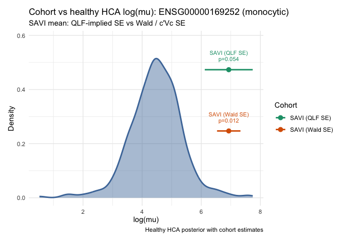

Cohort expression workflow (native edgeR)
================
Chen Zhan
2026-09-09

SAVI case study: *ADRB2* (`ENSG00000169252`) in disease-associated
monocytes.

This report mirrors
`vignette("cohort-expression-core", package = "posteriorHCA")`, but
**exposes the edgeR/limma steps inline** instead of calling posteriorHCA
helpers for scaling, offsets, fitting, contrast estimation, or SE
extraction.

Allowed posteriorHCA helpers **before** the HCA expression query:

```
load_reference_sample()
merge_with_reference_sample()
```

Everything else on the USER side is written with ordinary `edgeR`,
`limma`, and base R. The purpose is diagnostic:

> If we remove posteriorHCA’s edgeR helper abstractions, what is the
> simplest transparent sequence of native edgeR/limma calls that
> reproduces our scaling, USER model fitting, contrast estimate, and the
> proposed `glmQLFTest()`-derived uncertainty?

Workflow:

1.  Load / merge one HCA reference library with USER counts
2.  Joint TMMwsp scaling (explicit `calcNormFactors`)
3.  USER-only regression with `offset = log(E_user)`
4.  `model.matrix()` → `glmQLFit()` → `makeContrasts()` → `glmQLFTest()`
5.  Natural-log estimate + QLF-implied SE; shift absolute estimand by
    `log(E_HCA)`
6.  HCA posterior query and `welch_test_means()` (same as the core
    report)

## Setup

``` r
library(posteriorHCA)
library(Seurat)
library(AnnotationDbi)
library(org.Hs.eg.db)
library(edgeR)
library(limma)

cell_type <- "monocytic"
gene_ensg <- "ENSG00000169252"
```

## Prepare counts with Ensembl gene ids

Same USER dataset and metadata as the core-function report.

``` r
data(savi_mono)

user_counts <- as.matrix(Seurat::GetAssayData(savi_mono, layer = "counts"))
mapped <- AnnotationDbi::mapIds(
  org.Hs.eg.db,
  keys = rownames(user_counts),
  column = "ENSEMBL",
  keytype = "SYMBOL",
  multiVals = "first"
)
keep <- !is.na(mapped) & !duplicated(mapped)
user_counts <- user_counts[keep, , drop = FALSE]
rownames(user_counts) <- unname(mapped[keep])

sample_metadata <- data.frame(
  Category = factor(savi_mono$Category[colnames(user_counts)]),
  Experiment = factor(savi_mono$Experiment[colnames(user_counts)]),
  row.names = colnames(user_counts),
  stringsAsFactors = FALSE
)

dim(user_counts)
#> [1] 17116    17
table(sample_metadata$Category, sample_metadata$Experiment)
#>               
#>                EXP1 EXP2 EXP3
#>   CTRL            3    2    2
#>   SAVI            2    2    1
#>   SAVI_treated    3    2    0
```

## Reference preparation (posteriorHCA)

``` r
reference <- load_reference_sample(cell_type)
reference$sample_id
#> [1] "e11a0d767c2a97f658791b17cae25860____SC142___monocytic"
length(reference$counts)
#> [1] 10632

counts_joint <- merge_with_reference_sample(
  user_counts,
  reference = reference$counts,
  reference_name = reference$sample_id
)

reference_name <- reference$sample_id
dim(counts_joint)
#> [1] 9617   18
setdiff(colnames(counts_joint), colnames(user_counts))
#> [1] "e11a0d767c2a97f658791b17cae25860____SC142___monocytic"
```

The HCA reference is added only so joint TMM can put USER and HCA
libraries on a common scale. It must not enter the USER regression.

## Explicit joint TMMwsp scaling

Same default method as `calculate_tmm_scaling()` (`method = "TMMwsp"`).

``` r
ref_col <- match(reference_name, colnames(counts_joint))

norm_factors <- edgeR::calcNormFactors(
  counts_joint,
  refColumn = ref_col,
  method = "TMMwsp"
)

library_size <- colSums(counts_joint)
effective_size <- library_size * norm_factors

E_hca <- unname(effective_size[[reference_name]])
user_names <- setdiff(colnames(counts_joint), reference_name)
E_user <- effective_size[user_names]
log_E_user <- log(E_user)
log_E_hca <- log(E_hca)

data.frame(
  sample = c(user_names, reference_name),
  library_size = c(library_size[user_names], library_size[[reference_name]]),
  norm_factor = c(norm_factors[user_names], norm_factors[[reference_name]]),
  effective_size = c(E_user, E_hca),
  role = c(rep("user", length(user_names)), "hca_reference"),
  row.names = NULL
)
#>                                                   sample library_size
#> 1                    C1_17. Disease-associated monocytes       347205
#> 2                   C10_17. Disease-associated monocytes       122614
#> 3                   C11_17. Disease-associated monocytes       229924
#> 4                    C2_17. Disease-associated monocytes       426861
#> 5                    C7_17. Disease-associated monocytes        31483
#> 6      C8-aunt-P1-STING_17. Disease-associated monocytes        49498
#> 7    C9-mother-P1-STING_17. Disease-associated monocytes        81760
#> 8           P1-STING-ht_17. Disease-associated monocytes        24224
#> 9         P1-STING-ht-T_17. Disease-associated monocytes       127446
#> 10       P1-STING-ht-T2_17. Disease-associated monocytes        71463
#> 11          P2-STING-ht_17. Disease-associated monocytes        45098
#> 12        P2-STING-ht-T_17. Disease-associated monocytes        40347
#> 13          P4-STING-ht_17. Disease-associated monocytes      1527144
#> 14        P4-STING-ht-T_17. Disease-associated monocytes       241055
#> 15             P5-STING_17. Disease-associated monocytes       747477
#> 16          P6-STING-ht_17. Disease-associated monocytes      6123996
#> 17        P6-STING-ht-T_17. Disease-associated monocytes      1164357
#> 18 e11a0d767c2a97f658791b17cae25860____SC142___monocytic      3559173
#>    norm_factor effective_size          role
#> 1    1.0233563      355314.42          user
#> 2    1.3611822      166900.00          user
#> 3    1.3847878      318395.95          user
#> 4    1.2153675      518793.00          user
#> 5    1.2006225       37799.20          user
#> 6    0.9734889       48185.75          user
#> 7    0.9818609       80276.95          user
#> 8    1.3858786       33571.52          user
#> 9    0.9414885      119988.94          user
#> 10   0.8846274       63218.13          user
#> 11   1.1663582       52600.42          user
#> 12   1.0189958       41113.42          user
#> 13   0.6120595      934702.92          user
#> 14   0.8683783      209326.93          user
#> 15   0.8085947      604405.96          user
#> 16   0.6037752     3697516.63          user
#> 17   0.9937728     1157106.34          user
#> 18   1.0506977     3739615.04 hca_reference
c(E_hca = E_hca, log_E_hca = log_E_hca)
#>        E_hca    log_E_hca 
#> 3.739615e+06 1.513449e+01
```

## USER regression excludes the HCA reference

``` r
counts_fit <- counts_joint[, user_names, drop = FALSE]
metadata_fit <- sample_metadata[user_names, , drop = FALSE]
stopifnot(identical(colnames(counts_fit), rownames(metadata_fit)))

offset_mat <- matrix(
  log_E_user[colnames(counts_fit)],
  nrow = nrow(counts_fit),
  ncol = ncol(counts_fit),
  byrow = TRUE
)
dim(offset_mat)
#> [1] 9617   17
range(offset_mat[1, ] - log_E_user[colnames(counts_fit)])
#> [1] 0 0
```

Offset is `log(E_user)`. No `scaleOffset()`, and USER offsets are not
centred around `E_hca`.

## Design matrix

Primary design matches the core report’s SAVI group-mean estimand used
in Welch comparison: one mean per `Category`.

``` r
design <- model.matrix(~ 0 + Category, data = metadata_fit)
colnames(design)
#> [1] "CategoryCTRL"         "CategorySAVI"         "CategorySAVI_treated"
head(design)
#>                                                   CategoryCTRL CategorySAVI
#> C1_17. Disease-associated monocytes                          1            0
#> C10_17. Disease-associated monocytes                         1            0
#> C11_17. Disease-associated monocytes                         1            0
#> C2_17. Disease-associated monocytes                          1            0
#> C7_17. Disease-associated monocytes                          1            0
#> C8-aunt-P1-STING_17. Disease-associated monocytes            1            0
#>                                                   CategorySAVI_treated
#> C1_17. Disease-associated monocytes                                  0
#> C10_17. Disease-associated monocytes                                 0
#> C11_17. Disease-associated monocytes                                 0
#> C2_17. Disease-associated monocytes                                  0
#> C7_17. Disease-associated monocytes                                  0
#> C8-aunt-P1-STING_17. Disease-associated monocytes                    0
```

## Fit with `glmQLFit()` (edgeR v4 QL)

The current non-legacy edgeR v4 QL workflow estimates the NB dispersion
internally in `glmQLFit()`, while gene-specific variability is
represented through moderated quasi-dispersions (`s2.post`). No separate
`estimateDisp()` call. `prior.count = 0` matches the package helper on
Bioconductor release edgeR.

``` r
ql_args <- list(
  y = counts_fit,
  design = design,
  offset = offset_mat,
  robust = TRUE
)
if (utils::packageVersion("edgeR") < "4.99.0") {
  ql_args$prior.count <- 0
}
fit <- do.call(edgeR::glmQLFit, ql_args)

c(
  n_genes = nrow(fit),
  n_coef = ncol(fit$coefficients),
  nb_dispersion = unname(as.numeric(fit$dispersion)[[1]]),
  average_ql_dispersion = unname(as.numeric(fit$average.ql.dispersion)[[1]])
)
#>               n_genes                n_coef         nb_dispersion 
#>           9617.000000              3.000000              0.281383 
#> average_ql_dispersion 
#>              1.032946
```

## Contrast: absolute SAVI group mean

``` r
contrast <- limma::makeContrasts(
  CategorySAVI,
  levels = design
)
stopifnot(ncol(contrast) == 1L)
contrast
#>                       Contrasts
#> Levels                 CategorySAVI
#>   CategoryCTRL                    0
#>   CategorySAVI                    1
#>   CategorySAVI_treated            0
```

Interpretation: under `~ 0 + Category`, `CategorySAVI` is the absolute
normalized log mean for the SAVI group (not a difference, and not a
marginal mean over Experiment).

## `glmQLFTest()` → estimate + QLF-implied SE

``` r
qlf <- edgeR::glmQLFTest(fit, contrast = contrast)

# logFC is log2; convert to natural log used by posteriorHCA.
estimate_ln <- qlf$table$logFC * log(2)

# QLF-implied effective SE from the one-dimensional moderated QL F statistic.
# Not an exact coefficient-covariance SE; compatibility with Bayesian
# posterior SD is being evaluated separately.
se_ln <- abs(qlf$table$logFC) / sqrt(qlf$table$F) * log(2)

user_result <- data.frame(
  gene = rownames(qlf$table),
  estimate = estimate_ln,
  se = se_ln,
  F = qlf$table$F,
  PValue = qlf$table$PValue,
  stringsAsFactors = FALSE
)

user_gene <- user_result[user_result$gene == gene_ensg, , drop = FALSE]
user_gene
#>                 gene  estimate        se        F       PValue
#> 2617 ENSG00000169252 -8.204999 0.8109063 102.3801 5.367458e-11
```

## Shift absolute estimand to the HCA scale

Valid here because `CategorySAVI` is an **absolute** estimand. Do not
add `log(E_hca)` to a relative difference contrast.

``` r
user_gene$log_mu <- user_gene$estimate + log_E_hca
user_gene$mu <- exp(user_gene$log_mu)
user_gene$se_log_mu <- user_gene$se

n_savi <- sum(metadata_fit$Category == "SAVI")
user_log_mu <- user_gene$log_mu
user_se <- user_gene$se_log_mu

c(log_mu = user_log_mu, se = user_se, n = n_savi)
#>    log_mu        se         n 
#> 6.9294944 0.8109063 5.0000000
user_gene[, c("gene", "estimate", "log_mu", "mu", "se", "se_log_mu")]
#>                 gene  estimate   log_mu       mu        se se_log_mu
#> 2617 ENSG00000169252 -8.204999 6.929494 1021.977 0.8109063 0.8109063
```

## Diagnostic comparison with the core-function helpers

The block below calls posteriorHCA helpers **only** for side-by-side
diagnostics. The native path above does not depend on them.

``` r
scaling_pkg <- calculate_tmm_scaling(
  counts_joint,
  reference_name = reference_name
)

core_est <- estimate_ql(
  counts = counts_fit,
  offset = log_E_user[colnames(counts_fit)],
  metadata = metadata_fit,
  formula = ~ 0 + Category,
  contrast = "CategorySAVI"
)
core_est <- core_est[core_est$gene == gene_ensg, , drop = FALSE]

scaling_check <- data.frame(
  quantity = c("E_hca", "mean_E_user", "log_E_hca"),
  native = c(E_hca, mean(E_user), log_E_hca),
  package = c(
    scaling_pkg$hca_effective_library_size,
    mean(scaling_pkg$effective_size[user_names]),
    scaling_pkg$hca_log_effective_library_size
  )
)
scaling_check$diff <- scaling_check$native - scaling_check$package
scaling_check
#>      quantity       native      package diff
#> 1       E_hca 3.739615e+06 3.739615e+06    0
#> 2 mean_E_user 4.964245e+05 4.964245e+05    0
#> 3   log_E_hca 1.513449e+01 1.513449e+01    0

comparison <- data.frame(
  gene = gene_ensg,
  estimate_native_qlf = user_gene$estimate,
  estimate_core_wald = core_est$estimate,
  estimate_diff = user_gene$estimate - core_est$estimate,
  log_mu_native = user_gene$log_mu,
  log_mu_core = core_est$estimate + scaling_pkg$hca_log_effective_library_size,
  SE_QLF = user_gene$se,
  SE_Wald_core = core_est$se,
  SE_QLF_over_SE_Wald = user_gene$se / core_est$se,
  stringsAsFactors = FALSE
)
comparison
#>              gene estimate_native_qlf estimate_core_wald estimate_diff
#> 1 ENSG00000169252           -8.204999          -8.204999             0
#>   log_mu_native log_mu_core    SE_QLF SE_Wald_core SE_QLF_over_SE_Wald
#> 1      6.929494    6.929494 0.8109063    0.3961903             2.04676
```

Scaling and the natural-log point estimate should agree (same counts,
reference, TMMwsp, design, contrast, and `prior.count = 0`). The SE
ratio is diagnostic: QLF-implied SE versus the package Wald / `c'Vc` SE
need not be equal.

## HCA posterior

Same query as the core-function report (healthy blood, 10x Genomics 3).
The USER estimand is the SAVI Category mean under `~ 0 + Category` (no
Experiment conditioning). The HCA query is a healthy baseline for the
same cell type / gene; it is not conditioned on USER Experiment levels.

``` r
expression_fit <- load_expression_fit(
  cell_type = cell_type,
  gene_ensg = gene_ensg
)

newdata <- build_newdata_grid(
  expression_fit,
  disease_groups = "Normal",
  tissue_groups = "blood",
  assay_groups = "10x Genomics 3"
)

posterior_draws <- expression_draws(
  expression_fit,
  newdata = newdata,
  quantity = "linpred",
  collapse = "mean"
)
```

## Comparison

Welch tests of the same SAVI `log_mu` against the HCA posterior, using
either the QLF-implied SE (native path) or the Wald / `c'Vc` SE (core
helper). Point estimates match; only the SE changes.

``` r
posterior_summary <- summarize_posterior_draws(
  posterior_draws,
  value = user_log_mu
)

user_log_mu_core <- core_est$estimate + log_E_hca
user_se_core <- core_est$se

test_qlf <- welch_test_means(
  mu1 = user_log_mu,
  se1 = user_se,
  mu2 = posterior_summary$log_mu,
  se2 = posterior_summary$se,
  n1 = n_savi,
  n2 = posterior_summary$n
)
test_wald <- welch_test_means(
  mu1 = user_log_mu_core,
  se1 = user_se_core,
  mu2 = posterior_summary$log_mu,
  se2 = posterior_summary$se,
  n1 = n_savi,
  n2 = posterior_summary$n
)

test_results <- data.frame(
  group = c("SAVI (QLF SE)", "SAVI (Wald SE)"),
  n = n_savi,
  log_mu = c(test_qlf$mu1, test_wald$mu1),
  se = c(test_qlf$se1, test_wald$se1),
  hca_log_mu = c(test_qlf$mu2, test_wald$mu2),
  hca_se = c(test_qlf$se2, test_wald$se2),
  p_value = c(test_qlf$p_value, test_wald$p_value),
  stringsAsFactors = FALSE
)
test_results
#>            group n   log_mu        se hca_log_mu    hca_se    p_value
#> 1  SAVI (QLF SE) 5 6.929494 0.8109063    4.47276 0.8795577 0.05428090
#> 2 SAVI (Wald SE) 5 6.929494 0.3961903    4.47276 0.8795577 0.01221892
```

## Plots

``` r
plot_hca_draws(
  draws = posterior_draws,
  subtitle = "Normal, 10x Genomics 3 healthy baseline"
)
```

<!-- -->

``` r
plot_cohort_vs_hca(
  hca_draws = posterior_draws,
  cohort_est = test_results,
  subtitle = "SAVI mean: QLF-implied SE vs Wald / c'Vc SE",
  annotate = c("group", "p_value")
)
```

<!-- -->

## Session info

``` r
sessionInfo()
#> R version 4.6.1 (2026-06-24)
#> Platform: aarch64-apple-darwin23
#> Running under: macOS Tahoe 26.6.2
#> 
#> Matrix products: default
#> BLAS:   /Library/Frameworks/R.framework/Versions/4.6/Resources/lib/libRblas.0.dylib 
#> LAPACK: /Library/Frameworks/R.framework/Versions/4.6/Resources/lib/libRlapack.dylib;  LAPACK version 3.12.1
#> 
#> locale:
#> [1] en_US.UTF-8/en_US.UTF-8/en_US.UTF-8/C/en_US.UTF-8/en_US.UTF-8
#> 
#> time zone: Australia/Adelaide
#> tzcode source: internal
#> 
#> attached base packages:
#> [1] stats4    stats     graphics  grDevices utils     datasets  methods  
#> [8] base     
#> 
#> other attached packages:
#>  [1] edgeR_4.10.4         limma_3.68.5         org.Hs.eg.db_3.23.1 
#>  [4] AnnotationDbi_1.74.0 IRanges_2.46.0       S4Vectors_0.50.2    
#>  [7] Biobase_2.72.0       BiocGenerics_0.58.1  generics_0.1.4      
#> [10] Seurat_5.5.1         SeuratObject_5.4.0   sp_2.2-3            
#> [13] posteriorHCA_0.2.0   testthat_3.3.2      
#> 
#> loaded via a namespace (and not attached):
#>   [1] RcppAnnoy_0.0.23            splines_4.6.1              
#>   [3] later_1.4.8                 tibble_3.3.1               
#>   [5] polyclip_1.10-7             brms_2.23.0                
#>   [7] fastDummies_1.7.6           lifecycle_1.0.5            
#>   [9] StanHeaders_2.39.1          rprojroot_2.1.1            
#>  [11] vroom_1.7.1                 processx_3.9.0             
#>  [13] sccomp_2.4.0                globals_0.19.1             
#>  [15] lattice_0.23-1              MASS_7.3-66                
#>  [17] backports_1.5.1             magrittr_2.0.5             
#>  [19] plotly_4.12.1               rmarkdown_2.32             
#>  [21] yaml_2.3.12                 httpuv_1.6.17              
#>  [23] otel_0.2.0                  sctransform_0.4.3          
#>  [25] spam_2.11-4                 sessioninfo_1.2.4          
#>  [27] pkgbuild_1.4.8              spatstat.sparse_3.2-0      
#>  [29] reticulate_1.47.0           cowplot_1.2.0              
#>  [31] pbapply_1.7-5               DBI_1.3.0                  
#>  [33] RColorBrewer_1.1-3          abind_1.4-8                
#>  [35] pkgload_1.5.3               GenomicRanges_1.64.0       
#>  [37] Rtsne_0.17                  purrr_1.2.2                
#>  [39] tensorA_0.36.2.1            inline_0.3.21              
#>  [41] ggrepel_0.9.8               irlba_2.3.7                
#>  [43] listenv_1.0.0               spatstat.utils_3.2-4       
#>  [45] goftest_1.2-3               RSpectra_0.16-2            
#>  [47] spatstat.random_3.5-1       bridgesampling_1.2-1       
#>  [49] fitdistrplus_1.2-6          parallelly_1.48.0          
#>  [51] DelayedArray_0.38.2         codetools_0.2-20           
#>  [53] tidyselect_1.2.1            bayesplot_1.16.0           
#>  [55] farver_2.1.2                matrixStats_1.5.0          
#>  [57] spatstat.explore_3.8-2      Seqinfo_1.2.0              
#>  [59] jsonlite_2.0.0              ellipsis_0.3.3             
#>  [61] progressr_1.0.0             ggridges_0.5.7             
#>  [63] survival_3.8-11             tools_4.6.1                
#>  [65] ica_1.0-3                   Rcpp_1.1.2                 
#>  [67] glue_1.8.1                  SparseArray_1.12.2         
#>  [69] gridExtra_2.3.1             qs2_0.3.1                  
#>  [71] xfun_0.60                   cmdstanr_0.9.0             
#>  [73] MatrixGenerics_1.24.0       distributional_0.8.1       
#>  [75] usethis_3.2.1               dplyr_1.2.1                
#>  [77] withr_3.0.3                 loo_2.10.1                 
#>  [79] instantiate_0.2.3           fastmap_1.2.0              
#>  [81] callr_3.8.0                 digest_0.6.39              
#>  [83] R6_2.6.1                    mime_0.13                  
#>  [85] scattermore_1.2             tensor_1.5.1               
#>  [87] spatstat.data_3.1-9         RSQLite_3.53.3             
#>  [89] tidyr_1.3.2                 data.table_1.18.6.1        
#>  [91] S4Arrays_1.12.0             httr_1.4.9                 
#>  [93] htmlwidgets_1.6.4           uwot_0.2.5                 
#>  [95] pkgconfig_2.0.3             gtable_0.3.6               
#>  [97] blob_1.3.0                  lmtest_0.9-40              
#>  [99] S7_0.2.2                    SingleCellExperiment_1.34.0
#> [101] XVector_0.52.0              brio_1.1.5                 
#> [103] htmltools_0.5.9             dotCall64_1.2              
#> [105] scales_1.4.0                png_0.1-9                  
#> [107] posterior_1.7.0             spatstat.univar_3.2-0      
#> [109] knitr_1.52                  rstudioapi_0.19.0          
#> [111] tzdb_0.5.0                  reshape2_1.4.5             
#> [113] coda_0.19-4.1               checkmate_2.3.4            
#> [115] nlme_3.1-171                cachem_1.1.0               
#> [117] zoo_1.9-0                   stringr_1.6.0              
#> [119] KernSmooth_2.23-27          parallel_4.6.1             
#> [121] miniUI_0.1.2                desc_1.4.3                 
#> [123] pillar_1.11.1               grid_4.6.1                 
#> [125] vctrs_0.7.3                 RANN_2.6.3                 
#> [127] promises_1.5.0              stringfish_0.19.2          
#> [129] xtable_1.8-8                cluster_2.1.8.3            
#> [131] evaluate_1.0.5              readr_2.2.0                
#> [133] mvtnorm_1.4-2               cli_3.6.6                  
#> [135] locfit_1.5-9.12             compiler_4.6.1             
#> [137] rlang_1.3.0                 crayon_1.5.3               
#> [139] rstantools_2.7.1            future.apply_1.20.2        
#> [141] labeling_0.4.3              forcats_1.0.1              
#> [143] plyr_1.8.9                  fs_2.1.0                   
#> [145] rstan_2.32.7                stringi_1.8.9              
#> [147] QuickJSR_1.11.0             viridisLite_0.4.3          
#> [149] deldir_2.0-4                Biostrings_2.80.2          
#> [151] devtools_2.5.2              spatstat.geom_3.8-2        
#> [153] Brobdingnag_1.2-9           Matrix_1.7-6               
#> [155] RcppHNSW_0.7.0              hms_1.1.4                  
#> [157] patchwork_1.3.2             bit64_4.8.6                
#> [159] future_1.75.0               ggplot2_4.0.3              
#> [161] KEGGREST_1.52.2             statmod_1.5.2              
#> [163] shiny_1.14.0                SummarizedExperiment_1.42.0
#> [165] ROCR_1.0-12                 igraph_2.3.3               
#> [167] memoise_2.0.1               RcppParallel_6.2.1         
#> [169] bit_4.6.0
```
