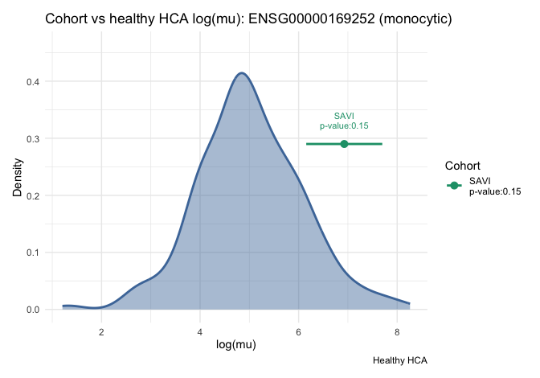

Cohort expression workflow (native edgeR)
================
Chen Zhan
2026-09-10

SAVI case study: *ADRB2* (`ENSG00000169252`) in disease-associated
monocytes.

Same analysis as `vignette("cohort-expression-core")`, with edgeR /
limma written out. Before the HCA query, only `load_reference_sample()`
and `merge_with_reference_sample()` come from posteriorHCA.

```
USER + HCA counts → TMMwsp → offset = log(E_user)
  → glmQLFit → makeContrasts → glmQLFTest
  → estimate + QLF SE → + log(E_HCA) → HCA posterior
```

## Setup

``` r
library(posteriorHCA)
library(Seurat)
library(AnnotationDbi)
library(org.Hs.eg.db)
library(edgeR)
library(limma)

cell_type <- "monocytic"
gene <- "ENSG00000169252"
ref_name <- "___hca_ref_sample___"
```

## Map gene name to Ensembl ids

``` r
data(savi_mono, overwrite = TRUE)

ensembl <- mapIds(
  org.Hs.eg.db,
  keys = rownames(savi_mono),
  column = "ENSEMBL",
  keytype = "SYMBOL",
  multiVals = "first"
)
ok <- !is.na(ensembl) & !duplicated(ensembl)
savi_mono <- savi_mono[ok, , drop = FALSE]
rownames(savi_mono) <- ensembl[ok] |> unname()
  
```

## Joint TMMwsp with one HCA library

``` r
ref <- load_reference_sample(cell_type)
counts <- merge_with_reference_sample(
  GetAssayData(savi_mono, layer = "counts"),
  reference = ref$counts,
  reference_name = ref_name
)

eff <- colSums(counts) * calcNormFactors(
  counts,
  refColumn = match(ref_name, colnames(counts)),
  method = "TMMwsp"
)

# USER libraries only → store on savi_mono; HCA size kept for the later shift
savi_mono$eff <- unname(eff[match(colnames(savi_mono), names(eff))])
savi_mono$log_E <- log(savi_mono$eff)
log_E_hca <- log(eff[[ref_name]])
```

The HCA column is only for TMM. Fitting uses `savi_mono` alone.

## Fit

``` r
design <- model.matrix(~ 0 + Category, data = savi_mono[[]])

fit <- glmQLFit(
  GetAssayData(savi_mono, layer = "counts"),
  design = design,
  offset = savi_mono$log_E,
  prior.count = 0,
  robust = TRUE
)

contrast <- makeContrasts(CategorySAVI, levels = design)
```

`CategorySAVI` is the absolute SAVI group log mean under
`~ 0 + Category`.

## Estimate and QLF-implied SE

`logFC` is log2; convert to natural log. The SE is implied by the
one-dimensional QL F statistic (not a coefficient-covariance SE).

``` r
qlf <- glmQLFTest(fit, contrast = contrast)

estimate <- qlf$table[gene, "logFC"] * log(2)
se_qlf <- abs(qlf$table[gene, "logFC"]) / sqrt(qlf$table[gene, "F"]) * log(2)

# Absolute estimand → HCA scale (SE unchanged)
log_mu <- estimate + log_E_hca
```

## HCA posterior

``` r
fit_hca <- load_expression_fit(cell_type = cell_type, gene_ensg = gene)
draws <- expression_draws(
  fit_hca,
  newdata = build_newdata_grid(fit_hca, tissue_groups = "blood" )
)
hca <- summarize_posterior_draws(draws)
```

## Welch test

``` r
test_res <-
  welch_test_means(
    mu1 = log_mu,
    se1 = se_qlf,
    n1 = sum(savi_mono$Category == "SAVI"),
    mu2 = hca$log_mu,
    se2 = hca$se,
    n2 = hca$n
  )
```

## Plot

``` r
plot_hca_draws(
  draws,
  query_mu = log_mu,
  query_SE = se_qlf,
  query_label = paste0("SAVI", '\n', 'p-value:', round(test_res$p_value, digits = 2))
)
```

<!-- -->

## Session info

``` r
sessionInfo()
#> R version 4.6.1 (2026-06-24)
#> Platform: aarch64-apple-darwin23
#> Running under: macOS Tahoe 26.6.2
#> 
#> Matrix products: default
#> BLAS:   /Library/Frameworks/R.framework/Versions/4.6/Resources/lib/libRblas.0.dylib 
#> LAPACK: /Library/Frameworks/R.framework/Versions/4.6/Resources/lib/libRlapack.dylib;  LAPACK version 3.12.1
#> 
#> locale:
#> [1] en_US.UTF-8/en_US.UTF-8/en_US.UTF-8/C/en_US.UTF-8/en_US.UTF-8
#> 
#> time zone: Australia/Adelaide
#> tzcode source: internal
#> 
#> attached base packages:
#> [1] stats4    stats     graphics  grDevices utils     datasets  methods  
#> [8] base     
#> 
#> other attached packages:
#>  [1] edgeR_4.10.4         limma_3.68.5         org.Hs.eg.db_3.23.1 
#>  [4] AnnotationDbi_1.74.0 IRanges_2.46.0       S4Vectors_0.50.2    
#>  [7] Biobase_2.72.0       BiocGenerics_0.58.1  generics_0.1.4      
#> [10] Seurat_5.5.1         SeuratObject_5.4.0   sp_2.2-3            
#> [13] posteriorHCA_0.2.0   testthat_3.3.2      
#> 
#> loaded via a namespace (and not attached):
#>   [1] RcppAnnoy_0.0.23            splines_4.6.1              
#>   [3] later_1.4.8                 tibble_3.3.1               
#>   [5] polyclip_1.10-7             brms_2.23.0                
#>   [7] fastDummies_1.7.6           lifecycle_1.0.5            
#>   [9] StanHeaders_2.39.1          rprojroot_2.1.1            
#>  [11] vroom_1.7.1                 processx_3.9.0             
#>  [13] sccomp_2.4.0                globals_0.19.1             
#>  [15] lattice_0.23-1              MASS_7.3-66                
#>  [17] backports_1.5.1             magrittr_2.0.5             
#>  [19] plotly_4.12.1               rmarkdown_2.32             
#>  [21] yaml_2.3.12                 httpuv_1.6.17              
#>  [23] otel_0.2.0                  sctransform_0.4.3          
#>  [25] spam_2.11-4                 sessioninfo_1.2.4          
#>  [27] pkgbuild_1.4.8              spatstat.sparse_3.2-0      
#>  [29] reticulate_1.47.0           cowplot_1.2.0              
#>  [31] pbapply_1.7-5               DBI_1.3.0                  
#>  [33] RColorBrewer_1.1-3          abind_1.4-8                
#>  [35] pkgload_1.5.3               GenomicRanges_1.64.0       
#>  [37] Rtsne_0.17                  purrr_1.2.2                
#>  [39] tensorA_0.36.2.1            inline_0.3.21              
#>  [41] ggrepel_0.9.8               irlba_2.3.7                
#>  [43] listenv_1.0.0               spatstat.utils_3.2-4       
#>  [45] goftest_1.2-3               RSpectra_0.16-2            
#>  [47] spatstat.random_3.5-1       bridgesampling_1.2-1       
#>  [49] fitdistrplus_1.2-6          parallelly_1.48.0          
#>  [51] DelayedArray_0.38.2         codetools_0.2-20           
#>  [53] tidyselect_1.2.1            bayesplot_1.16.0           
#>  [55] farver_2.1.2                matrixStats_1.5.0          
#>  [57] spatstat.explore_3.8-2      Seqinfo_1.2.0              
#>  [59] jsonlite_2.0.0              ellipsis_0.3.3             
#>  [61] progressr_1.0.0             ggridges_0.5.7             
#>  [63] survival_3.8-11             tools_4.6.1                
#>  [65] ica_1.0-3                   Rcpp_1.1.2                 
#>  [67] glue_1.8.1                  SparseArray_1.12.2         
#>  [69] gridExtra_2.3.1             qs2_0.3.1                  
#>  [71] xfun_0.60                   cmdstanr_0.9.0             
#>  [73] MatrixGenerics_1.24.0       distributional_0.8.1       
#>  [75] usethis_3.2.1               dplyr_1.2.1                
#>  [77] withr_3.0.3                 loo_2.10.1                 
#>  [79] instantiate_0.2.3           fastmap_1.2.0              
#>  [81] callr_3.8.0                 digest_0.6.39              
#>  [83] R6_2.6.1                    mime_0.13                  
#>  [85] scattermore_1.2             tensor_1.5.1               
#>  [87] spatstat.data_3.1-9         RSQLite_3.53.3             
#>  [89] tidyr_1.3.2                 data.table_1.18.6.1        
#>  [91] S4Arrays_1.12.0             httr_1.4.9                 
#>  [93] htmlwidgets_1.6.4           uwot_0.2.5                 
#>  [95] pkgconfig_2.0.3             gtable_0.3.6               
#>  [97] blob_1.3.0                  lmtest_0.9-40              
#>  [99] S7_0.2.2                    SingleCellExperiment_1.34.0
#> [101] XVector_0.52.0              brio_1.1.5                 
#> [103] htmltools_0.5.9             dotCall64_1.2              
#> [105] scales_1.4.0                png_0.1-9                  
#> [107] posterior_1.7.0             spatstat.univar_3.2-0      
#> [109] knitr_1.52                  rstudioapi_0.19.0          
#> [111] tzdb_0.5.0                  reshape2_1.4.5             
#> [113] coda_0.19-4.1               checkmate_2.3.4            
#> [115] nlme_3.1-171                cachem_1.1.0               
#> [117] zoo_1.9-0                   stringr_1.6.0              
#> [119] KernSmooth_2.23-27          parallel_4.6.1             
#> [121] miniUI_0.1.2                desc_1.4.3                 
#> [123] pillar_1.11.1               grid_4.6.1                 
#> [125] vctrs_0.7.3                 RANN_2.6.3                 
#> [127] promises_1.5.0              stringfish_0.19.2          
#> [129] xtable_1.8-8                cluster_2.1.8.3            
#> [131] evaluate_1.0.5              readr_2.2.0                
#> [133] mvtnorm_1.4-2               cli_3.6.6                  
#> [135] locfit_1.5-9.12             compiler_4.6.1             
#> [137] rlang_1.3.0                 crayon_1.5.3               
#> [139] rstantools_2.7.1            future.apply_1.20.2        
#> [141] labeling_0.4.3              forcats_1.0.1              
#> [143] plyr_1.8.9                  fs_2.1.0                   
#> [145] rstan_2.32.7                stringi_1.8.9              
#> [147] QuickJSR_1.11.0             viridisLite_0.4.3          
#> [149] deldir_2.0-4                Biostrings_2.80.2          
#> [151] devtools_2.5.2              spatstat.geom_3.8-2        
#> [153] Brobdingnag_1.2-9           Matrix_1.7-6               
#> [155] RcppHNSW_0.7.0              hms_1.1.4                  
#> [157] patchwork_1.3.2             bit64_4.8.6                
#> [159] future_1.75.0               ggplot2_4.0.3              
#> [161] KEGGREST_1.52.2             statmod_1.5.2              
#> [163] shiny_1.14.0                SummarizedExperiment_1.42.0
#> [165] ROCR_1.0-12                 igraph_2.3.3               
#> [167] memoise_2.0.1               RcppParallel_6.2.1         
#> [169] bit_4.6.0
```
