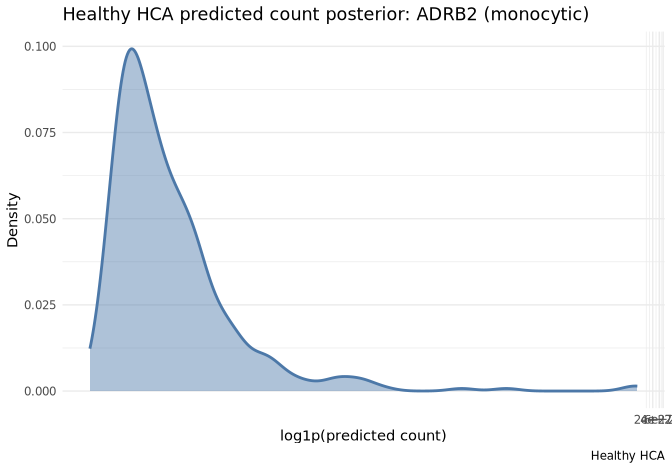
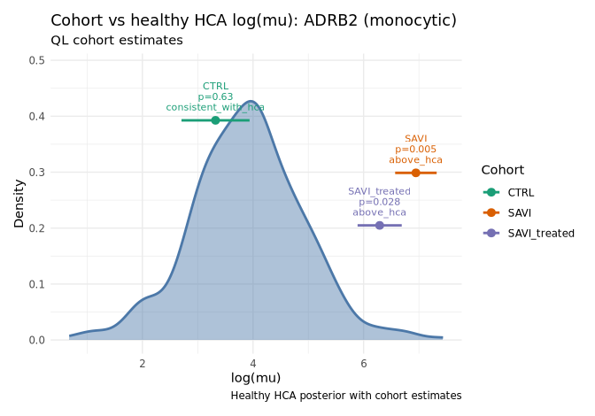
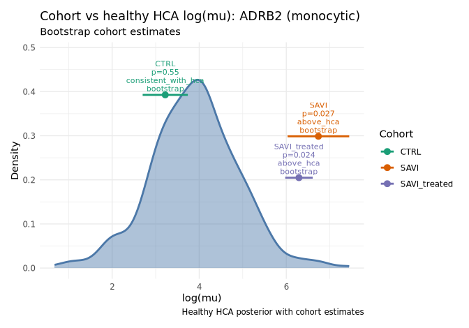

Cohort expression workflow
================
Chen Zhan
2026-09-01

This vignette walks through the **cohort vs healthy HCA baseline**
workflow using the SAVI case study and *ADRB2* in disease-associated
monocytes. The steps mirror `examples/savi_adrb2_workflow.R`:

1.  Prepare pseudobulk counts (`savi_mono`)
2.  Align cohort libraries to an HCA reference sample
3.  Estimate cohort log(μ) with edgeR QL
4.  Draw a healthy HCA posterior from pre-trained `brms` models
5.  Test cohorts with a Welch *t*-test against the HCA draws
6.  Optionally bootstrap cohort log(μ) and repeat the test
7.  Plot healthy baseline and cohort comparisons

## Setup

``` r
library(posteriorHCA)
library(Seurat)
library(ggplot2)
```

The workflow needs **Seurat**, **brms**, and gene-id mapping packages
(`org.Hs.eg.db`, `AnnotationDbi`). Chunks below run only when those are
available (`can_run = TRUE`).

## Prepare `savi_mono`

The SAVI study ([de Cevins *et al.*,
2023](https://doi.org/10.1016/j.xcrm.2023.101333)) includes pseudobulk
RNA-seq from PBMC cell types. We focus on **disease-associated
monocytes** and the gene **ADRB2**.

The full pseudobulk object can be built from GEO accession
[GSE226598](https://www.ncbi.nlm.nih.gov/geo/query/acc.cgi?acc=GSE226598)
(see the case-study `prepare_data.R` script). The code below shows how
`savi_mono` is defined:

``` r
savi_path <- "GSE226598_SAVI_pseudobulk_Sample_CellType.rds"
savi <- readRDS(savi_path)
savi_mono <- subset(savi, subset = CellType == "17. Disease-associated monocytes")
```

For this vignette we load the bundled example object:

``` r
data(savi_mono)
dim(savi_mono)
#> [1] 24431    17
table(savi_mono$Category)
#> 
#>         CTRL         SAVI SAVI_treated 
#>            7            5            5
```

Gene symbols are harmonised to Ensembl IDs so cohort counts and HCA
models use the same row names:

``` r
savi_mono <- harmonise_gene_ids(savi_mono, id_type = "symbol")
```

## Align to the HCA monocytic reference

`scale_to_hca_reference()` appends one HCA reference library, computes
TMM normalisation factors, and stores alignment metadata (`hca_offset`,
`sample_role`, etc.) on each sample.

``` r
cell_type <- "monocytic"
ref <- get_reference_sample_ready(cell_type)
aligned <- scale_to_hca_reference(savi_mono, ref)

table(aligned$sample_role)
#> 
#> reference      user 
#>         1        17
```

## Estimate cohort log(μ)

Cohort point estimates use edgeR quasi-likelihood standard errors at the
atlas offset-zero scale:

``` r
est <- estimate_cohort_logmu(
  aligned,
  group = "Category",
  genes = "ADRB2"
)
est
#>              gene gene_symbol cell_type        group n   log_mu         mu
#> 1 ENSG00000169252       ADRB2 monocytic         CTRL 7 3.322306   27.72420
#> 2 ENSG00000169252       ADRB2 monocytic    reference 1 4.530958   92.84749
#> 3 ENSG00000169252       ADRB2 monocytic         SAVI 5 6.945427 1038.39071
#> 4 ENSG00000169252       ADRB2 monocytic SAVI_treated 5 6.290005  539.15625
#>          se       df dispersion
#> 1 0.6154281 18.98187  0.2226158
#> 2 0.8046448 18.98187  0.2226158
#> 3 0.3751294 18.98187  0.2226158
#> 4 0.3992543 18.98187  0.2226158
```

## Healthy HCA baseline draws

Load the pre-trained expression model for monocytic *ADRB2* and draw
from the healthy (`Normal`) 10x Genomics 3 reference:

``` r
fit <- load_expr_fit(cell_type = cell_type, gene = "ADRB2")

grid <- build_newdata_grid(
  fit,
  disease_groups = "Normal",
  assay_groups = "10x Genomics 3"
)

hca_res <- expr_draws(
  fit,
  newdata = grid,
  quantity = "linpred",
  collapse = "mean"
)

round(c(mean = mean(hca_res$draws), sd = sd(hca_res$draws)), 3)
#>  mean    sd 
#> 3.895 1.004
```

`expr_predict()` is a convenience wrapper that also returns a density
plot for count-scale predictions:

``` r
hca_pred <- expr_predict(
  cell_type = cell_type,
  gene = "ADRB2",
  disease_groups = "Normal",
  assay_groups = "10x Genomics 3",
  quantity = "predict",
  collapse = "mean"
)
hca_pred$plot
```

<!-- -->

## Test cohorts against the healthy baseline (QL)

`welch_t_test_cohort_hca()` compares each cohort log(μ) estimate to the
HCA posterior using a Welch *t*-test. The reference group is excluded by
default.

``` r
test_results <- welch_t_test_cohort_hca(
  cohort_est = est,
  hca_draws = hca_res
)
test_results
#>              gene gene_symbol cell_type       cohort method cohort_log_mu
#> 1 ENSG00000169252       ADRB2 monocytic         CTRL     ql      3.322306
#> 2 ENSG00000169252       ADRB2 monocytic         SAVI     ql      6.945427
#> 3 ENSG00000169252       ADRB2 monocytic SAVI_treated     ql      6.290005
#>   cohort_se hca_mean   hca_sd delta_log_mu  se_diff     t_stat       df
#> 1 0.6154281 3.895135 1.004446   -0.5728294 1.177991 -0.4862764  72.7745
#> 2 0.3751294 3.895135 1.004446    3.0502924 1.072210  2.8448654 176.1785
#> 3 0.3992543 3.895135 1.004446    2.3948704 1.080887  2.2156539 153.3055
#>       p_value empirical_rank           direction
#> 1 0.628232338         0.2700 consistent_with_hca
#> 2 0.004969434         0.9975           above_hca
#> 3 0.028189044         0.9850           above_hca
```

## Bootstrap cohort log(μ) (optional)

For a non-parametric cohort uncertainty estimate,
`bootstrap_cohort_logmu_batch()` mirrors the QL workflow: one call
bootstraps every cohort and returns a table compatible with testing and
plotting.

``` r
boot_est <- bootstrap_cohort_logmu_batch(
  aligned,
  group = "Category",
  genes = "ADRB2",
  cohort_est = est,
  hca_draws = hca_res,
  n_boot = 200L,
  seed = 42L
)
boot_est
#>              gene gene_symbol cell_type        group n   log_mu       mu
#> 1 ENSG00000169252       ADRB2 monocytic         CTRL 7 3.219623  25.0187
#> 2 ENSG00000169252       ADRB2 monocytic         SAVI 5 6.737798 843.7005
#> 3 ENSG00000169252       ADRB2 monocytic SAVI_treated 5 6.291284 539.8458
#>          se df dispersion    method boot_q025 boot_q975 empirical_rank
#> 1 0.5189373 NA  0.2226158 bootstrap  1.834222  3.855647         0.2375
#> 2 0.7082203 NA  0.2226158 bootstrap  5.540832  7.974241         0.9925
#> 3 0.3158899 NA  0.2226158 bootstrap  5.569030  6.737193         0.9850

boot_test <- welch_t_test_cohort_hca(
  cohort_est = boot_est,
  hca_draws = hca_res
)
boot_test
#>              gene gene_symbol cell_type       cohort    method cohort_log_mu
#> 1 ENSG00000169252       ADRB2 monocytic         CTRL bootstrap      3.219623
#> 2 ENSG00000169252       ADRB2 monocytic         SAVI bootstrap      6.737798
#> 3 ENSG00000169252       ADRB2 monocytic SAVI_treated bootstrap      6.291284
#>   cohort_se hca_mean   hca_sd delta_log_mu  se_diff    t_stat        df
#> 1 0.5189373 3.895135 1.004446   -0.6755116 1.130578 -0.597492 111.61575
#> 2 0.7082203 3.895135 1.004446    2.8426626 1.229019  2.312953  34.86205
#> 3 0.3158899 3.895135 1.004446    2.3961486 1.052947  2.275659 243.86857
#>      p_value empirical_rank           direction
#> 1 0.55138919         0.2375 consistent_with_hca
#> 2 0.02674884         0.9925           above_hca
#> 3 0.02373455         0.9850           above_hca
```

## Visualise results

`plot_hca_draws()` shows the healthy HCA posterior alone.
`plot_cohort_vs_hca()` overlays cohort estimates and accepts either
Welch test output or cohort estimate tables (QL or bootstrap).

``` r
plot_hca_draws(
  draws = hca_res,
  subtitle = "Normal, 10x Genomics 3 healthy baseline"
)
```

<!-- -->

``` r
plot_cohort_vs_hca(
  hca_draws = hca_res,
  test_results = test_results,
  subtitle = "QL cohort estimates",
  annotate = c("group", "p_value", "direction")
)
```

<!-- -->

``` r
plot_cohort_vs_hca(
  hca_draws = hca_res,
  test_results = boot_test,
  subtitle = "Bootstrap cohort estimates",
  annotate = c("group", "p_value", "direction", "method")
)
```

<!-- -->

You can also pass `cohort_est = est` or `cohort_est = boot_est` directly
to `plot_cohort_vs_hca()` when test statistics are not needed on the
plot.

## Session info

``` r
sessionInfo()
#> R version 4.5.3 (2026-03-11)
#> Platform: x86_64-conda-linux-gnu
#> Running under: Red Hat Enterprise Linux 8.4 (Ootpa)
#> 
#> Matrix products: default
#> BLAS/LAPACK: /home/a1237163/miniconda3/envs/R_env/lib/libopenblasp-r0.3.29.so;  LAPACK version 3.12.0
#> 
#> locale:
#>  [1] LC_CTYPE=C.UTF-8       LC_NUMERIC=C           LC_TIME=C.UTF-8       
#>  [4] LC_COLLATE=C.UTF-8     LC_MONETARY=C.UTF-8    LC_MESSAGES=C.UTF-8   
#>  [7] LC_PAPER=C.UTF-8       LC_NAME=C              LC_ADDRESS=C          
#> [10] LC_TELEPHONE=C         LC_MEASUREMENT=C.UTF-8 LC_IDENTIFICATION=C   
#> 
#> time zone: Australia/Adelaide
#> tzcode source: system (glibc)
#> 
#> attached base packages:
#> [1] stats     graphics  grDevices utils     datasets  methods   base     
#> 
#> other attached packages:
#> [1] ggplot2_4.0.3      Seurat_5.5.0       SeuratObject_5.4.0 sp_2.2-1          
#> [5] posteriorHCA_0.2.0 testthat_3.3.2     rmarkdown_2.31    
#> 
#> loaded via a namespace (and not attached):
#>   [1] fs_2.1.0                    matrixStats_1.5.0          
#>   [3] spatstat.sparse_3.2-0       devtools_2.5.2             
#>   [5] httr_1.4.8                  RColorBrewer_1.1-3         
#>   [7] tools_4.5.3                 sctransform_0.4.3          
#>   [9] backports_1.5.1             R6_2.6.1                   
#>  [11] lazyeval_0.2.3              uwot_0.2.4                 
#>  [13] withr_3.0.3                 Brobdingnag_1.2-9          
#>  [15] gridExtra_2.3.1             progressr_0.19.0           
#>  [17] cli_3.6.6                   Biobase_2.70.0             
#>  [19] spatstat.explore_3.8-1      fastDummies_1.7.6          
#>  [21] sandwich_3.1-1              labeling_0.4.3             
#>  [23] mvtnorm_1.4-2               dittoSeq_1.22.0            
#>  [25] S7_0.2.2                    spatstat.data_3.1-9        
#>  [27] brms_2.23.1                 readr_2.2.0                
#>  [29] ggridges_0.5.7              pbapply_1.7-4              
#>  [31] QuickJSR_1.10.0             StanHeaders_2.39.0.9000    
#>  [33] dichromat_2.0-0.1           parallelly_1.48.0          
#>  [35] sessioninfo_1.2.3           limma_3.66.0               
#>  [37] rstudioapi_0.18.0           RSQLite_3.53.1             
#>  [39] generics_0.1.4              ica_1.0-3                  
#>  [41] spatstat.random_3.5-0       vroom_1.7.1                
#>  [43] dplyr_1.2.1                 distributional_0.8.1       
#>  [45] inline_0.3.21               loo_2.10.0.9000            
#>  [47] Matrix_1.7-5                S4Vectors_0.48.1           
#>  [49] abind_1.4-8                 lifecycle_1.0.5            
#>  [51] multcomp_1.4-30             yaml_2.3.12                
#>  [53] edgeR_4.8.2                 SummarizedExperiment_1.40.0
#>  [55] SparseArray_1.10.10         Rtsne_0.17                 
#>  [57] grid_4.5.3                  blob_1.3.0                 
#>  [59] promises_1.5.0              crayon_1.5.3               
#>  [61] miniUI_0.1.2                lattice_0.22-9             
#>  [63] cowplot_1.2.0               KEGGREST_1.50.0            
#>  [65] pillar_1.11.1               knitr_1.51                 
#>  [67] GenomicRanges_1.62.1        estimability_1.5.1         
#>  [69] future.apply_1.20.2         codetools_0.2-20           
#>  [71] glue_1.8.1                  spatstat.univar_3.2-0      
#>  [73] data.table_1.18.4           vctrs_0.7.3                
#>  [75] png_0.1-9                   spam_2.11-3                
#>  [77] gtable_0.3.6                cachem_1.1.0               
#>  [79] xfun_0.57                   S4Arrays_1.10.1            
#>  [81] mime_0.13                   Seqinfo_1.0.0              
#>  [83] coda_0.19-4.1               survival_3.8-6             
#>  [85] sccomp_2.2.0                SingleCellExperiment_1.32.0
#>  [87] pheatmap_1.0.13             statmod_1.5.2              
#>  [89] ellipsis_0.3.3              fitdistrplus_1.2-6         
#>  [91] TH.data_1.1-5               ROCR_1.0-12                
#>  [93] nlme_3.1-169                usethis_3.2.1              
#>  [95] bit64_4.8.2                 RcppAnnoy_0.0.23           
#>  [97] rstan_2.39.0.9000           rprojroot_2.1.1            
#>  [99] tensorA_0.36.2.1            irlba_2.3.7                
#> [101] KernSmooth_2.23-26          otel_0.2.0                 
#> [103] colorspace_2.1-2            BiocGenerics_0.56.0        
#> [105] DBI_1.3.0                   tidyselect_1.2.1           
#> [107] processx_3.9.0              emmeans_2.0.3              
#> [109] bit_4.6.0                   compiler_4.5.3             
#> [111] curl_7.1.0                  desc_1.4.3                 
#> [113] DelayedArray_0.36.1         plotly_4.12.0              
#> [115] stringfish_0.19.0           posterior_1.7.1            
#> [117] checkmate_2.3.4             scales_1.4.0               
#> [119] lmtest_0.9-40               callr_3.8.0                
#> [121] stringr_1.6.0               digest_0.6.39              
#> [123] goftest_1.2-3               spatstat.utils_3.2-3       
#> [125] XVector_0.50.0              htmltools_0.5.9            
#> [127] pkgconfig_2.0.3             MatrixGenerics_1.22.0      
#> [129] fastmap_1.2.0               rlang_1.3.0                
#> [131] htmlwidgets_1.6.4           shiny_1.14.0               
#> [133] farver_2.1.2                zoo_1.8-15                 
#> [135] jsonlite_2.0.0              magrittr_2.0.5             
#> [137] dotCall64_1.2               bayesplot_1.15.0.9000      
#> [139] patchwork_1.3.2             Rcpp_1.1.2                 
#> [141] reticulate_1.46.0           stringi_1.8.9              
#> [143] brio_1.1.5                  MASS_7.3-65                
#> [145] plyr_1.8.9                  org.Hs.eg.db_3.22.0        
#> [147] pkgbuild_1.4.8              parallel_4.5.3             
#> [149] listenv_1.0.0               ggrepel_0.9.8              
#> [151] forcats_1.0.1               deldir_2.0-4               
#> [153] Biostrings_2.78.0           splines_4.5.3              
#> [155] tensor_1.5.1                hms_1.1.4                  
#> [157] locfit_1.5-9.12             ps_1.9.3                   
#> [159] igraph_2.3.1                spatstat.geom_3.8-1        
#> [161] RcppHNSW_0.7.0              reshape2_1.4.5             
#> [163] qs2_0.2.1                   stats4_4.5.3               
#> [165] pkgload_1.5.2               rstantools_2.6.0.9000      
#> [167] evaluate_1.0.5              RcppParallel_5.1.11-2      
#> [169] tzdb_0.5.0                  httpuv_1.6.17              
#> [171] RANN_2.6.2                  tidyr_1.3.2                
#> [173] purrr_1.2.2                 polyclip_1.10-7            
#> [175] future_1.75.0               scattermore_1.2            
#> [177] xtable_1.8-8                RSpectra_0.16-2            
#> [179] later_1.4.8                 viridisLite_0.4.3          
#> [181] instantiate_0.2.3           tibble_3.3.1               
#> [183] memoise_2.0.1               AnnotationDbi_1.72.0       
#> [185] IRanges_2.44.0              cluster_2.1.8.2            
#> [187] globals_0.19.1              cmdstanr_0.9.0             
#> [189] bridgesampling_1.2-1
```
