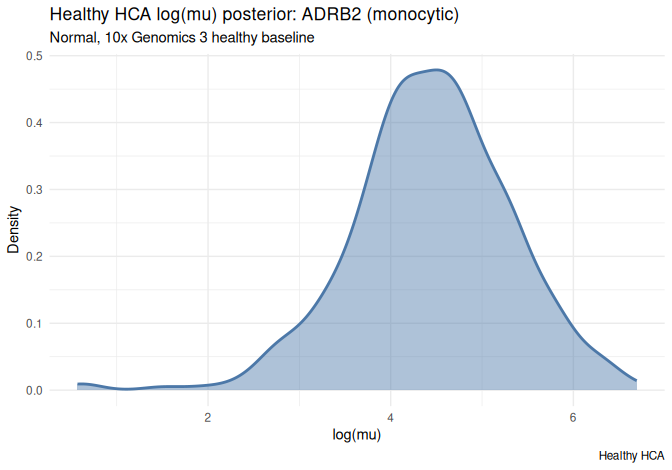
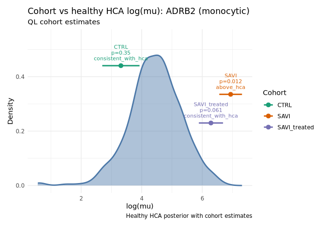
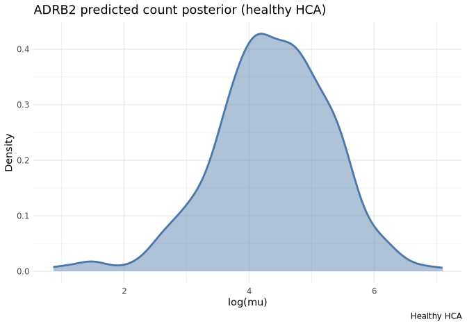

Cohort expression workflow
================
Chen Zhan
2026-09-03

This vignette follows `examples/savi_adrb2_workflow.R` for the SAVI case
study (*ADRB2* in disease-associated monocytes, PBMC / blood):

1.  Prepare pseudobulk counts (`savi_mono`)
2.  Align to the HCA monocytic reference
3.  Estimate cohort log(μ) with edgeR QL
4.  Draw healthy HCA posterior (Normal, blood, 10x Genomics 3)
5.  Welch test vs HCA (wrapper + manual helpers)
6.  Plot results

## Setup

``` r
library(posteriorHCA)
library(Seurat)
library(tidyseurat)
library(dplyr)
library(purrr)
library(ggplot2)

cell_type <- "monocytic"
```

## 1. Prepare `savi_mono`

The SAVI study ([de Cevins *et al.*,
2023](https://doi.org/10.1016/j.xcrm.2023.101333)) is PBMC scRNA-seq
pseudobulked by sample and cell type. We subset **disease-associated
monocytes** (17 samples: CTRL, SAVI, SAVI_treated).

``` r
savi_path <- "GSE226598_SAVI_pseudobulk_Sample_CellType.rds"
savi <- readRDS(savi_path)
savi_mono <- subset(savi, subset = CellType == "17. Disease-associated monocytes")
```

``` r
data(savi_mono)
dim(savi_mono)
#> [1] 17138    17
table(savi_mono$Category)
#> 
#>         CTRL         SAVI SAVI_treated 
#>            7            5            5
```

Harmonise gene symbols to Ensembl IDs so cohort counts and HCA models
share row names:

``` r
savi_mono <- harmonise_gene_ids(savi_mono, id_type = "auto")
```

## 2. Align to the HCA monocytic reference

`scale_to_hca_reference()` appends one HCA library, TMM-aligns all
samples, and stores `hca_offset` and `sample_role` on each column.

``` r
aligned <- scale_to_hca_reference(savi_mono, cell_type)

table(aligned$sample_role)
#> 
#> reference      user 
#>         1        17
```

## 3. Estimate cohort log(μ)

Primary model: group means with `~ 0 + Category` (includes atlas
reference).

``` r
est <- estimate_cohort_logmu(
  aligned,
  formula = ~ 0 + Category,
  genes = "ADRB2"
)
est
#>              gene gene_symbol cell_type        group n   log_mu         mu
#> 1 ENSG00000169252       ADRB2 monocytic         CTRL 7 3.322306   27.72420
#> 2 ENSG00000169252       ADRB2 monocytic         SAVI 5 6.945427 1038.39071
#> 3 ENSG00000169252       ADRB2 monocytic SAVI_treated 5 6.290005  539.15625
#> 4 ENSG00000169252       ADRB2 monocytic    reference 1 4.530958   92.84749
#>          se       df dispersion
#> 1 0.6154281 18.98187  0.2226158
#> 2 0.3751294 18.98187  0.2226158
#> 3 0.3992543 18.98187  0.2226158
#> 4 0.8046448 18.98187  0.2226158
```

Alternative: estimate each `Category` level separately with `~ 1` (as in
the reference script):

``` r
est_by_level <- purrr::map_dfr(
  aligned$Category %>% levels(),
  .f = function(x) {
    estimate_cohort_logmu(
      aligned %>% dplyr::filter(Category == x),
      formula = ~ 1,
      genes = "ADRB2"
    ) %>%
      dplyr::mutate(group = x)
  }
)
est_by_level
#>              gene gene_symbol cell_type        group n   log_mu         mu
#> 1 ENSG00000169252       ADRB2 monocytic         CTRL 7 3.319235   27.63921
#> 2 ENSG00000169252       ADRB2 monocytic         SAVI 5 6.914247 1006.51269
#> 3 ENSG00000169252       ADRB2 monocytic SAVI_treated 5 6.292433  540.46659
#>          se        df dispersion
#> 1 0.3984058 10.899835  0.2300399
#> 2 0.2621220  3.994552  0.3382149
#> 3 0.2118680  3.953785  0.2076096
```

## 4. Healthy HCA baseline draws

Load the cached brms fit and draw from Normal / blood / 10x Genomics 3.

``` r
fit <- load_expr_fit(cell_type = cell_type, gene = "ADRB2")

grid <- build_newdata_grid(
  fit,
  disease_groups = "Normal",
  tissue_groups = "blood",
  assay_groups = "10x Genomics 3"
)

hca_res <- expr_draws(
  fit,
  newdata = grid,
  quantity = "linpred",
  collapse = "mean"
)

round(c(mean = mean(hca_res$draws), sd = sd(hca_res$draws)), 3)
#>  mean    sd 
#> 4.444 0.869
```

Same fit via `expr_predict()` (convenience wrapper used in the Welch
wrapper below):

``` r
hca_pred <- expr_predict(
  fit = fit,
  disease_groups = "Normal",
  tissue_groups = "blood",
  assay_groups = "10x Genomics 3",
  quantity = "linpred",
  collapse = "mean"
)
```

## 5. Test cohorts against the healthy baseline

### Wrapper

``` r
test_results <- welch_t_test_cohort_hca(
  cohort_est = est,
  hca_draws = hca_pred
)
test_results
#>              gene gene_symbol cell_type       cohort method cohort_log_mu
#> 1 ENSG00000169252       ADRB2 monocytic         CTRL     ql      3.322306
#> 2 ENSG00000169252       ADRB2 monocytic         SAVI     ql      6.945427
#> 3 ENSG00000169252       ADRB2 monocytic SAVI_treated     ql      6.290005
#>   cohort_se hca_mean    hca_sd delta_log_mu  se_diff     t_stat        df
#> 1 0.6154281 4.373241 0.9304786    -1.050935 1.115591 -0.9420441  60.06341
#> 2 0.3751294 4.373241 0.9304786     2.572186 1.003251  2.5638515 148.34013
#> 3 0.3992543 4.373241 0.9304786     1.916764 1.012519  1.8930655 127.68952
#>      p_value empirical_rank           direction
#> 1 0.34994378         0.1150 consistent_with_hca
#> 2 0.01134607         0.9975           above_hca
#> 3 0.06061239         0.9900 consistent_with_hca
```

### Manual workflow (one cohort)

``` r
cohort <- cohort_estimate_at(est, group = "SAVI")
baseline <- summarize_posterior_draws(hca_res, value = cohort$mu)

welch_test_means(
  cohort$mu, cohort$se,
  baseline$mean, baseline$sd,
  n1 = cohort$n, n2 = baseline$n
)
#> $mu1
#> [1] 6.945427
#> 
#> $se1
#> [1] 0.3751294
#> 
#> $n1
#> [1] 5
#> 
#> $mu2
#> [1] 4.444192
#> 
#> $se2
#> [1] 0.8688719
#> 
#> $n2
#> [1] 400
#> 
#> $delta
#> [1] 2.501236
#> 
#> $se_diff
#> [1] 0.9463934
#> 
#> $t_stat
#> [1] 2.642913
#> 
#> $df
#> [1] 125.7561
#> 
#> $p_value
#> [1] 0.009264845
```

## 6. Visualise results

``` r
plot_hca_draws(
  draws = hca_res,
  subtitle = "Normal, 10x Genomics 3 healthy baseline"
)
```

<!-- -->

``` r
plot_cohort_vs_hca(
  hca_draws = hca_res,
  test_results = test_results,
  subtitle = "QL cohort estimates",
  annotate = c("group", "p_value", "direction")
)
```

<!-- -->

``` r
plot_hca_draws(
  draws = hca_pred,
  title = "ADRB2 predicted count posterior (healthy HCA)"
)
```

<!-- -->

## Session info

``` r
sessionInfo()
#> R version 4.5.3 (2026-03-11)
#> Platform: x86_64-pc-linux-gnu
#> Running under: Ubuntu 24.04.4 LTS
#> 
#> Matrix products: default
#> BLAS:   /usr/lib/x86_64-linux-gnu/openblas-pthread/libblas.so.3 
#> LAPACK: /usr/lib/x86_64-linux-gnu/openblas-pthread/libopenblasp-r0.3.26.so;  LAPACK version 3.12.0
#> 
#> locale:
#>  [1] LC_CTYPE=en_US.UTF-8       LC_NUMERIC=C              
#>  [3] LC_TIME=en_US.UTF-8        LC_COLLATE=en_US.UTF-8    
#>  [5] LC_MONETARY=en_US.UTF-8    LC_MESSAGES=en_US.UTF-8   
#>  [7] LC_PAPER=en_US.UTF-8       LC_NAME=C                 
#>  [9] LC_ADDRESS=C               LC_TELEPHONE=C            
#> [11] LC_MEASUREMENT=en_US.UTF-8 LC_IDENTIFICATION=C       
#> 
#> time zone: Etc/UTC
#> tzcode source: system (glibc)
#> 
#> attached base packages:
#> [1] stats     graphics  grDevices utils     datasets  methods   base     
#> 
#> other attached packages:
#>  [1] posteriorHCA_0.2.0 purrr_1.2.2        ggplot2_4.0.3      tidyr_1.3.2       
#>  [5] dplyr_1.2.1        tidyseurat_0.8.10  ttservice_0.5.3    Seurat_5.5.0      
#>  [9] SeuratObject_5.4.0 sp_2.2-1           testthat_3.3.2    
#> 
#> loaded via a namespace (and not attached):
#>   [1] fs_2.1.0                    matrixStats_1.5.0          
#>   [3] spatstat.sparse_3.1-0       devtools_2.5.1             
#>   [5] httr_1.4.8                  RColorBrewer_1.1-3         
#>   [7] tools_4.5.3                 sctransform_0.4.3          
#>   [9] backports_1.5.1             R6_2.6.1                   
#>  [11] lazyeval_0.2.3              uwot_0.2.4                 
#>  [13] withr_3.0.2                 Brobdingnag_1.2-9          
#>  [15] gridExtra_2.3               progressr_0.19.0           
#>  [17] cli_3.6.6                   Biobase_2.70.0             
#>  [19] spatstat.explore_3.8-0      fastDummies_1.7.6          
#>  [21] sandwich_3.1-1              labeling_0.4.3             
#>  [23] sass_0.4.10                 mvtnorm_1.3-7              
#>  [25] dittoSeq_1.22.0             S7_0.2.2                   
#>  [27] spatstat.data_3.1-9         brms_2.23.0                
#>  [29] readr_2.2.0                 ggridges_0.5.7             
#>  [31] pbapply_1.7-4               QuickJSR_1.9.2             
#>  [33] StanHeaders_2.39.0.9000     dichromat_2.0-0.1          
#>  [35] parallelly_1.47.0           sessioninfo_1.2.3          
#>  [37] limma_3.66.0                rstudioapi_0.18.0          
#>  [39] RSQLite_2.4.6               generics_0.1.4             
#>  [41] ica_1.0-3                   spatstat.random_3.4-5      
#>  [43] vroom_1.7.1                 distributional_0.7.0       
#>  [45] inline_0.3.21               loo_2.10.1.9000            
#>  [47] Matrix_1.7-5                fansi_1.0.7                
#>  [49] S4Vectors_0.48.1            abind_1.4-8                
#>  [51] lifecycle_1.0.5             multcomp_1.4-30            
#>  [53] yaml_2.3.12                 edgeR_4.8.2                
#>  [55] SummarizedExperiment_1.40.0 SparseArray_1.10.10        
#>  [57] Rtsne_0.17                  grid_4.5.3                 
#>  [59] blob_1.3.0                  promises_1.5.0             
#>  [61] crayon_1.5.3                miniUI_0.1.2               
#>  [63] lattice_0.22-9              cowplot_1.2.0              
#>  [65] KEGGREST_1.50.0             pillar_1.11.1              
#>  [67] knitr_1.51                  GenomicRanges_1.62.1       
#>  [69] estimability_1.5.1          future.apply_1.20.2        
#>  [71] codetools_0.2-20            glue_1.8.1                 
#>  [73] spatstat.univar_3.1-7       data.table_1.18.2.1        
#>  [75] vctrs_0.7.3                 png_0.1-9                  
#>  [77] spam_2.11-3                 gtable_0.3.6               
#>  [79] cachem_1.1.0                xfun_0.57                  
#>  [81] S4Arrays_1.10.1             mime_0.13                  
#>  [83] Seqinfo_1.0.0               coda_0.19-4.1              
#>  [85] survival_3.8-6              sccomp_2.2.0               
#>  [87] SingleCellExperiment_1.32.0 pheatmap_1.0.13            
#>  [89] statmod_1.5.1               ellipsis_0.3.3             
#>  [91] fitdistrplus_1.2-6          TH.data_1.1-5              
#>  [93] ROCR_1.0-12                 nlme_3.1-169               
#>  [95] usethis_3.2.1               bit64_4.8.0                
#>  [97] RcppAnnoy_0.0.23            rstan_2.39.0.9000          
#>  [99] rprojroot_2.1.1             tensorA_0.36.2.1           
#> [101] bslib_0.10.0                irlba_2.3.7                
#> [103] KernSmooth_2.23-26          otel_0.2.0                 
#> [105] colorspace_2.1-2            BiocGenerics_0.56.0        
#> [107] DBI_1.3.0                   tidyselect_1.2.1           
#> [109] processx_3.9.0              emmeans_2.0.3              
#> [111] curl_7.1.0                  bit_4.6.0                  
#> [113] compiler_4.5.3              desc_1.4.3                 
#> [115] DelayedArray_0.36.1         plotly_4.12.0              
#> [117] stringfish_0.19.0           posterior_1.7.1            
#> [119] checkmate_2.3.4             scales_1.4.0               
#> [121] lmtest_0.9-40               callr_3.7.6                
#> [123] stringr_1.6.0               digest_0.6.39              
#> [125] goftest_1.2-3               spatstat.utils_3.2-2       
#> [127] rmarkdown_2.31              XVector_0.50.0             
#> [129] htmltools_0.5.9             pkgconfig_2.0.3            
#> [131] MatrixGenerics_1.22.0       fastmap_1.2.0              
#> [133] rlang_1.2.0                 htmlwidgets_1.6.4          
#> [135] shiny_1.13.0                farver_2.1.2               
#> [137] jquerylib_0.1.4             zoo_1.8-15                 
#> [139] jsonlite_2.0.0              magrittr_2.0.5             
#> [141] dotCall64_1.2               bayesplot_1.16.0.9000      
#> [143] patchwork_1.3.2             Rcpp_1.1.1-1               
#> [145] reticulate_1.46.0           stringi_1.8.7              
#> [147] brio_1.1.5                  MASS_7.3-65                
#> [149] plyr_1.8.9                  org.Hs.eg.db_3.22.0        
#> [151] pkgbuild_1.4.8              parallel_4.5.3             
#> [153] listenv_0.10.1              ggrepel_0.9.8              
#> [155] forcats_1.0.1               deldir_2.0-4               
#> [157] Biostrings_2.78.0           splines_4.5.3              
#> [159] tensor_1.5.1                hms_1.1.4                  
#> [161] locfit_1.5-9.12             ps_1.9.3                   
#> [163] igraph_2.3.0                spatstat.geom_3.7-3        
#> [165] RcppHNSW_0.6.0              reshape2_1.4.5             
#> [167] qs2_0.2.0                   stats4_4.5.3               
#> [169] pkgload_1.5.2               rstantools_2.7.0           
#> [171] evaluate_1.0.5              RcppParallel_5.1.11-2      
#> [173] tzdb_0.5.0                  httpuv_1.6.17              
#> [175] RANN_2.6.2                  polyclip_1.10-7            
#> [177] future_1.70.0               scattermore_1.2            
#> [179] xtable_1.8-8                RSpectra_0.16-2            
#> [181] later_1.4.8                 viridisLite_0.4.3          
#> [183] instantiate_0.2.3           tibble_3.3.1               
#> [185] memoise_2.0.1               AnnotationDbi_1.72.0       
#> [187] IRanges_2.44.0              cluster_2.1.8.2            
#> [189] globals_0.19.1              cmdstanr_0.9.0             
#> [191] bridgesampling_1.2-1
```
