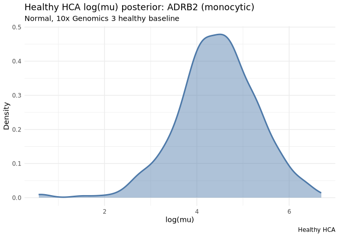
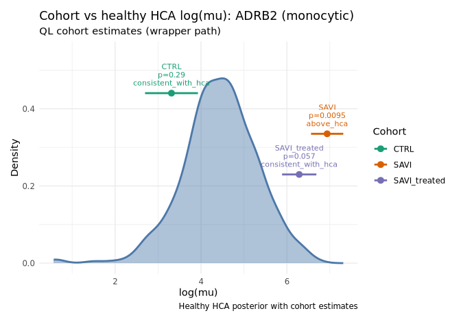

Cohort expression workflow (wrappers)
================
Chen Zhan
2026-09-04

**Wrapper** path for the SAVI case study (*ADRB2* in disease-associated
monocytes, PBMC / blood). Same marked steps as the core vignette, with
Seurat / formula / gene-id handling. See
`vignette("cohort-expression-core", package = "posteriorHCA")` for the
matrix-level cores.

Steps:

0.  Align to one HCA reference library (`scale_to_hca_reference`)  
1.  Estimate cohort log(μ) (`estimate_cohort_logmu`)  
2.  Load the healthy expression fit (`load_expr_fit`)  
3.  Draw the HCA baseline (`expr_predict`)  
    4–5. Welch test vs baseline (`welch_t_test_cohort_hca`)

## Setup

``` r
library(posteriorHCA)
library(Seurat)
library(dplyr)

cell_type <- "monocytic"
```

## Prepare `savi_mono`

The SAVI study ([de Cevins *et al.*,
2023](https://doi.org/10.1016/j.xcrm.2023.101333)) is PBMC scRNA-seq
pseudobulked by sample and cell type. We subset **disease-associated
monocytes** (17 samples: CTRL, SAVI, SAVI_treated).

``` r
savi_path <- "GSE226598_SAVI_pseudobulk_Sample_CellType.rds"
savi <- readRDS(savi_path)
savi_mono <- subset(savi, subset = CellType == "17. Disease-associated monocytes")
```

``` r
data(savi_mono)
savi_mono <- harmonise_gene_ids(savi_mono, id_type = "auto")
dim(savi_mono)
#> [1] 17138    17
table(savi_mono$Category)
#> 
#>         CTRL         SAVI SAVI_treated 
#>            7            5            5
```

## Step 0. Align to the HCA monocytic reference

Calls `merge_with_reference_sample()` + `calculate_tmm_offset()`, then
rebuilds the Seurat object with `hca_offset` and `sample_role`.

``` r
aligned <- scale_to_hca_reference(savi_mono, cell_type)

table(aligned$sample_role)
#> 
#> reference      user 
#>         1        17
aligned$hca_reference_name[1]
#>                     C1_17. Disease-associated monocytes 
#> "e11a0d767c2a97f658791b17cae25860____SC142___monocytic"
aligned$hca_offset[aligned$hca_reference_name[1]]
#> e11a0d767c2a97f658791b17cae25860____SC142___monocytic 
#>                                                     0
```

## Step 1. Estimate cohort log(μ)

`estimate_cohort_logmu()` builds the design from a formula, fits all
genes via `estimate_logmu_ql()`, then filters to `genes`. Dispersion
still uses the full matrix. Prefer a cell-means design such as
`~ 0 + Category`.

``` r
est <- estimate_cohort_logmu(
  aligned,
  formula = ~ 0 + Category,
  genes = "ADRB2"
)
est
#>              gene gene_symbol cell_type        group n   log_mu         mu
#> 1 ENSG00000169252       ADRB2 monocytic         CTRL 7 3.313065   27.46918
#> 2 ENSG00000169252       ADRB2 monocytic         SAVI 5 6.937536 1030.22874
#> 3 ENSG00000169252       ADRB2 monocytic SAVI_treated 5 6.286779  537.41932
#> 4 ENSG00000169252       ADRB2 monocytic    reference 1 4.530958   92.84749
#>          se       df dispersion
#> 1 0.6154281 18.98187  0.2226158
#> 2 0.3751294 18.98187  0.2226158
#> 3 0.3992543 18.98187  0.2226158
#> 4 0.8046448 18.98187  0.2226158
```

### Optional: single-cohort `~ 1`

Subset to one `Category`, fit with `formula = ~ 1`, and treat the
intercept as that cohort’s absolute log(μ).

``` r
est_by_level <- purrr::map_dfr(
  levels(aligned$Category),
  .f = function(x) {
    estimate_cohort_logmu(
      subset(aligned, Category == x),
      formula = ~ 1,
      genes = "ADRB2"
    ) %>%
      dplyr::mutate(group = x)
  }
)
est_by_level
#>              gene gene_symbol cell_type        group n   log_mu         mu
#> 1 ENSG00000169252       ADRB2 monocytic         CTRL 7 3.334290   28.05845
#> 2 ENSG00000169252       ADRB2 monocytic         SAVI 5 6.908769 1001.01467
#> 3 ENSG00000169252       ADRB2 monocytic SAVI_treated 5 6.292121  540.29813
#>          se        df dispersion
#> 1 0.3984058 10.899835  0.2300399
#> 2 0.2621220  3.994552  0.3382149
#> 3 0.2118680  3.953785  0.2076096
```

## Step 2. Load the healthy expression fit

``` r
fit <- load_expr_fit(cell_type = cell_type, gene = "ADRB2")
```

## Step 3. Draw the healthy HCA baseline

`expr_predict()` wraps grid construction and `expr_draws()`.
`quantity = "linpred"` is log(μ) on the natural-log scale.

``` r
hca_pred <- expr_predict(
  fit = fit,
  disease_groups = "Normal",
  tissue_groups = "blood",
  assay_groups = "10x Genomics 3",
  quantity = "linpred",
  collapse = "mean"
)

round(c(mean = mean(hca_pred$draws), sd = sd(hca_pred$draws)), 3)
#>  mean    sd 
#> 4.444 0.869
```

## Steps 4–5. Welch test vs the healthy baseline

`welch_t_test_cohort_hca()` loops cohorts (skips atlas `reference` by
default) and combines baseline summary + `welch_test_means()`.

``` r
test_results <- welch_t_test_cohort_hca(
  cohort_est = est,
  hca_draws = hca_pred
)
test_results
#>              gene gene_symbol cell_type       cohort method cohort_log_mu
#> 1 ENSG00000169252       ADRB2 monocytic         CTRL     ql      3.313065
#> 2 ENSG00000169252       ADRB2 monocytic         SAVI     ql      6.937536
#> 3 ENSG00000169252       ADRB2 monocytic SAVI_treated     ql      6.286779
#>   cohort_se hca_mean    hca_sd delta_log_mu   se_diff    t_stat       df
#> 1 0.6154281 4.444192 0.8688719    -1.131127 1.0647489 -1.062342  50.7259
#> 2 0.3751294 4.444192 0.8688719     2.493344 0.9463934  2.634575 125.7561
#> 3 0.3992543 4.444192 0.8688719     1.842587 0.9562125  1.926964 107.4467
#>       p_value empirical_rank           direction
#> 1 0.293112125          0.090 consistent_with_hca
#> 2 0.009483039          1.000           above_hca
#> 3 0.056625245          0.985 consistent_with_hca
```

## Plots

``` r
plot_hca_draws(
  draws = hca_pred,
  subtitle = "Normal, 10x Genomics 3 healthy baseline"
)
```

<!-- -->

``` r
plot_cohort_vs_hca(
  hca_draws = hca_pred,
  test_results = test_results,
  subtitle = "QL cohort estimates (wrapper path)",
  annotate = c("group", "p_value", "direction")
)
```

<!-- -->

## Session info

``` r
sessionInfo()
#> R version 4.5.3 (2026-03-11)
#> Platform: x86_64-conda-linux-gnu
#> Running under: Red Hat Enterprise Linux 8.4 (Ootpa)
#> 
#> Matrix products: default
#> BLAS/LAPACK: /home/a1237163/miniconda3/envs/R_env/lib/libopenblasp-r0.3.29.so;  LAPACK version 3.12.0
#> 
#> locale:
#>  [1] LC_CTYPE=en_US.UTF-8       LC_NUMERIC=C              
#>  [3] LC_TIME=en_US.UTF-8        LC_COLLATE=en_US.UTF-8    
#>  [5] LC_MONETARY=en_US.UTF-8    LC_MESSAGES=en_US.UTF-8   
#>  [7] LC_PAPER=en_US.UTF-8       LC_NAME=C                 
#>  [9] LC_ADDRESS=C               LC_TELEPHONE=C            
#> [11] LC_MEASUREMENT=en_US.UTF-8 LC_IDENTIFICATION=C       
#> 
#> time zone: Australia/Adelaide
#> tzcode source: system (glibc)
#> 
#> attached base packages:
#> [1] stats     graphics  grDevices utils     datasets  methods   base     
#> 
#> other attached packages:
#> [1] dplyr_1.2.1        posteriorHCA_0.2.0 Seurat_5.5.0       SeuratObject_5.4.0
#> [5] sp_2.2-1           testthat_3.3.2    
#> 
#> loaded via a namespace (and not attached):
#>   [1] fs_2.1.0                    matrixStats_1.5.0          
#>   [3] spatstat.sparse_3.2-0       devtools_2.5.2             
#>   [5] httr_1.4.8                  RColorBrewer_1.1-3         
#>   [7] tools_4.5.3                 sctransform_0.4.3          
#>   [9] backports_1.5.1             R6_2.6.1                   
#>  [11] lazyeval_0.2.3              uwot_0.2.4                 
#>  [13] withr_3.0.3                 Brobdingnag_1.2-9          
#>  [15] gridExtra_2.3.1             progressr_0.19.0           
#>  [17] cli_3.6.6                   Biobase_2.70.0             
#>  [19] spatstat.explore_3.8-1      fastDummies_1.7.6          
#>  [21] sandwich_3.1-1              labeling_0.4.3             
#>  [23] sass_0.4.10                 mvtnorm_1.4-2              
#>  [25] S7_0.2.2                    spatstat.data_3.1-9        
#>  [27] brms_2.23.1                 readr_2.2.0                
#>  [29] ggridges_0.5.7              pbapply_1.7-4              
#>  [31] QuickJSR_1.10.0             StanHeaders_2.39.0.9000    
#>  [33] dichromat_2.0-0.1           parallelly_1.48.0          
#>  [35] sessioninfo_1.2.3           limma_3.66.0               
#>  [37] rstudioapi_0.18.0           RSQLite_3.53.1             
#>  [39] generics_0.1.4              ica_1.0-3                  
#>  [41] spatstat.random_3.5-0       vroom_1.7.1                
#>  [43] distributional_0.8.1        inline_0.3.21              
#>  [45] loo_2.10.0.9000             Matrix_1.7-5               
#>  [47] S4Vectors_0.48.1            abind_1.4-8                
#>  [49] lifecycle_1.0.5             multcomp_1.4-30            
#>  [51] yaml_2.3.12                 edgeR_4.8.2                
#>  [53] SummarizedExperiment_1.40.0 SparseArray_1.10.10        
#>  [55] Rtsne_0.17                  grid_4.5.3                 
#>  [57] blob_1.3.0                  promises_1.5.0             
#>  [59] crayon_1.5.3                miniUI_0.1.2               
#>  [61] lattice_0.22-9              cowplot_1.2.0              
#>  [63] KEGGREST_1.50.0             pillar_1.11.1              
#>  [65] knitr_1.51                  GenomicRanges_1.62.1       
#>  [67] estimability_1.5.1          future.apply_1.20.2        
#>  [69] codetools_0.2-20            glue_1.8.1                 
#>  [71] spatstat.univar_3.2-0       data.table_1.18.4          
#>  [73] vctrs_0.7.3                 png_0.1-9                  
#>  [75] spam_2.11-3                 gtable_0.3.6               
#>  [77] cachem_1.1.0                xfun_0.57                  
#>  [79] S4Arrays_1.10.1             mime_0.13                  
#>  [81] Seqinfo_1.0.0               coda_0.19-4.1              
#>  [83] survival_3.8-6              sccomp_2.2.0               
#>  [85] SingleCellExperiment_1.32.0 statmod_1.5.2              
#>  [87] ellipsis_0.3.3              fitdistrplus_1.2-6         
#>  [89] TH.data_1.1-5               ROCR_1.0-12                
#>  [91] nlme_3.1-169                usethis_3.2.1              
#>  [93] bit64_4.8.2                 RcppAnnoy_0.0.23           
#>  [95] rstan_2.39.0.9000           rprojroot_2.1.1            
#>  [97] tensorA_0.36.2.1            bslib_0.12.0               
#>  [99] irlba_2.3.7                 KernSmooth_2.23-26         
#> [101] otel_0.2.0                  BiocGenerics_0.56.0        
#> [103] DBI_1.3.0                   tidyselect_1.2.1           
#> [105] processx_3.9.0              emmeans_2.0.3              
#> [107] bit_4.6.0                   compiler_4.5.3             
#> [109] curl_7.1.0                  desc_1.4.3                 
#> [111] DelayedArray_0.36.1         plotly_4.12.0              
#> [113] stringfish_0.19.0           posterior_1.7.1            
#> [115] checkmate_2.3.4             scales_1.4.0               
#> [117] lmtest_0.9-40               callr_3.8.0                
#> [119] stringr_1.6.0               digest_0.6.39              
#> [121] goftest_1.2-3               spatstat.utils_3.2-3       
#> [123] rmarkdown_2.31              XVector_0.50.0             
#> [125] htmltools_0.5.9             pkgconfig_2.0.3            
#> [127] MatrixGenerics_1.22.0       fastmap_1.2.0              
#> [129] rlang_1.3.0                 htmlwidgets_1.6.4          
#> [131] shiny_1.14.0                jquerylib_0.1.4            
#> [133] farver_2.1.2                zoo_1.8-15                 
#> [135] jsonlite_2.0.0              magrittr_2.0.5             
#> [137] dotCall64_1.2               bayesplot_1.15.0.9000      
#> [139] patchwork_1.3.2             Rcpp_1.1.2                 
#> [141] reticulate_1.46.0           stringi_1.8.9              
#> [143] brio_1.1.5                  MASS_7.3-65                
#> [145] plyr_1.8.9                  org.Hs.eg.db_3.22.0        
#> [147] pkgbuild_1.4.8              parallel_4.5.3             
#> [149] listenv_1.0.0               ggrepel_0.9.8              
#> [151] forcats_1.0.1               deldir_2.0-4               
#> [153] Biostrings_2.78.0           splines_4.5.3              
#> [155] tensor_1.5.1                hms_1.1.4                  
#> [157] locfit_1.5-9.12             ps_1.9.3                   
#> [159] igraph_2.3.1                spatstat.geom_3.8-1        
#> [161] RcppHNSW_0.7.0              reshape2_1.4.5             
#> [163] qs2_0.2.1                   stats4_4.5.3               
#> [165] pkgload_1.5.2               rstantools_2.6.0.9000      
#> [167] evaluate_1.0.5              RcppParallel_5.1.11-2      
#> [169] tzdb_0.5.0                  httpuv_1.6.17              
#> [171] RANN_2.6.2                  tidyr_1.3.2                
#> [173] purrr_1.2.2                 polyclip_1.10-7            
#> [175] future_1.75.0               scattermore_1.2            
#> [177] ggplot2_4.0.3               xtable_1.8-8               
#> [179] RSpectra_0.16-2             later_1.4.8                
#> [181] viridisLite_0.4.3           instantiate_0.2.3          
#> [183] tibble_3.3.1                memoise_2.0.1              
#> [185] AnnotationDbi_1.72.0        IRanges_2.44.0             
#> [187] cluster_2.1.8.2             globals_0.19.1             
#> [189] cmdstanr_0.9.0              bridgesampling_1.2-1
```
